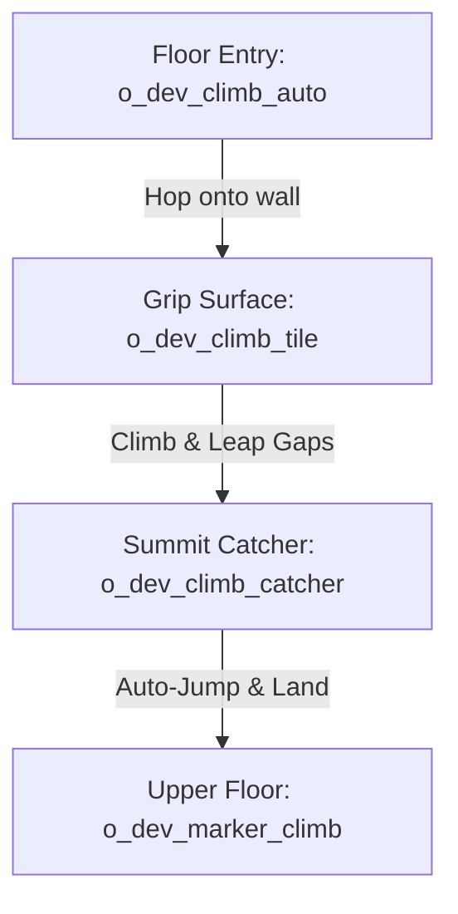

# Climbing and traversal

DELTARUNE Chapter 2 introduced vertical climbing sections — Kris scaling towering book shelves, castle spires, and wire fences while followers wait or cheer from below. tlDR Engine includes a dedicated, physics-based **Climbing System** (`scripts/climb/climb.gml`, `objects/o_dev_climb_controller/`) that handles vertical movement, wall hopping, falling physics, and smooth entry/exit transitions.

This chapter explains how the climbing system works, followed by a step-by-step tutorial to build a complete vertical climbing section from scratch.

---

## How climbing works in the engine

When the player enters climbing mode, the engine shifts movement rules from top-down walking to a 2D wall-grid:

1. **Leader transitions:** The party leader switches to their climbing sprite (`s_climb`, e.g. `spr_kris_climb`) and faces upward.
2. **Followers fade out:** Other party members smoothly fade out (`party_fade_out()`) so they do not clutter the vertical climb.
3. **Wall grid navigation:** The leader moves freely across instances of `o_dev_climb_tile`. If the player reaches an edge, they can leap across gaps to nearby climb tiles.
4. **Summit exit:** Touching an exit catcher (`o_dev_climb_catcher`) or calling `climb_stop_nearest()` makes the leader jump onto the landing marker (`o_dev_marker_climb`), reassembles the party, and restores normal walking.

---

## The five climbing objects

| Object | Layer | Purpose |
|---|---|---|
| **`o_dev_climb_tile`** | `collisions` (depth 0) | Defines the climbable surface area. Stretch these across your background wall. |
| **`o_dev_climb_auto`** | `Instances` (depth 300) | A floor trigger that **automatically** launches the player onto the wall upon stepping on it. |
| **`o_dev_climb_interact`** | `Instances` (depth 300) | An interactable trigger requiring the player to press **[CONFIRM]** to start climbing. |
| **`o_dev_climb_catcher`** | `Instances` (depth 300) | Placed at the top or bottom of a climb path to detect arrival and trigger exit. |
| **`o_dev_marker_climb`** | `Instances` (depth 300) | The exact spot where the player lands on solid ground after finishing a climb. |

---

## Tutorial: Your first climbing wall in 5 steps

Let's build a 200-pixel vertical wall climb with a floor entry trigger, climbable grip tiles, a gap to leap over, and a summit landing where Susie and followers rejoin you.



### Step 0 — Prepare the room layers

1. Open your room in the GameMaker Room Editor.
2. Ensure you have your standard layers:
   - **`t_foreground`** (depth `-4000`) — for any vines or awnings in front of the climber.
   - **`collisions`** (depth `0`) — where climb tiles and walls live.
   - **`Instances`** (depth `300`) — where controllers, triggers, and markers live.
   - **`t_buildings`** / **`t_road`** (depth `600`–`1000`) — for wall and floor tiles.

### Step 1 — Place the climbable tiles (`o_dev_climb_tile`)

1. Select the **`collisions`** layer (depth `0`).
2. Drag **`o_dev_climb_tile`** onto the room and stretch it over the wall from the bottom floor up to the top ledge.
3. If you want a gap to jump across, leave a 20–40 pixel space between two `o_dev_climb_tile` instances.

Each climb tile has default properties in `objects/o_dev_climb_tile/Create_0.gml`:
```gml
can_climb = true;        // Solid grip
display_outline = true;  // Displays border in debug view
```

### Step 2 — Place the entrance trigger (`o_dev_climb_auto`)

1. Select the **`Instances`** layer (depth `300`).
2. Drag **`o_dev_climb_auto`** directly onto the floor at the base of your climbable wall.
3. Stretch its width to match the bottom edge of the wall.

When Kris steps onto this trigger, `climb_start_nearest()` fires automatically:
- Plays `snd_wing` and `snd_noise`.
- Kris hops onto the wall and switches to `spr_kris_climb`.
- Susie, Ralsei, and other followers fade out smoothly.

### Step 3 — Place the summit catcher (`o_dev_climb_catcher`)

1. Still on the **`Instances`** layer, drag **`o_dev_climb_catcher`** to the very top edge of the climbing wall.
2. Stretch its width so Kris cannot climb past the summit without touching it.

When Kris climbs into `o_dev_climb_catcher`, the engine initiates the landing sequence.

### Step 4 — Place the landing marker (`o_dev_marker_climb`)

1. Drag **`o_dev_marker_climb`** onto the solid floor just above the ledge where you want Kris to stand.
2. Place an `o_block` underneath the landing floor on the `collisions` layer so Kris does not fall through.

When the catcher detects the player:
- Kris leaps from the wall onto `o_dev_marker_climb` with `actor_movement_jump_into`.
- Normal top-down movement is restored.
- Followers fade back in and line up behind Kris (`party_fade_in()`).

### Step 5 — Add a slippery obstacle (Optional)

To create an obstacle (e.g. loose bricks, spikes, or electric vines):
1. Place an `o_dev_climb_tile` over the obstacle area.
2. Open its **Instance Creation Code** and write:
   ```gml
   can_climb = false;
   ```

When Kris tries to move onto this tile, they will slip and fall with gravity until catching a valid climb tile below or landing on the ground.

---

## Testing checklist

Run your game (`F5`) and test the climbing sequence:

- [ ] Walking onto `o_dev_climb_auto` hops Kris onto the wall with a whoosh sound.
- [ ] Party followers fade out cleanly without lingering on screen.
- [ ] Pressing `[UP]`, `[DOWN]`, `[LEFT]`, `[RIGHT]` crawls across `o_dev_climb_tile` instances.
- [ ] Tapping toward a gap leaps Kris across to the adjacent wall.
- [ ] Reaching `o_dev_climb_catcher` hops Kris onto `o_dev_marker_climb`.
- [ ] Normal movement resumes and party followers fade back in cleanly.

---

## Climbing controls & mechanics

The climbing controller (`objects/o_dev_climb_controller/`) manages physics while on the wall:

| Action | Control | Engine behavior |
|---|---|---|
| **Up / Down / Left / Right** | Arrow Keys | Crawls across adjacent `o_dev_climb_tile` instances (`move_reach = 23`). |
| **Wall Leap** | Direction + Tap | Jumps across gaps to another climb tile up to `jump_reach_max = 50` px away. |
| **Speed Boost / Dash** | Run Key | Accelerates climbing speed temporarily (`speed_boost_timer`). |
| **Falling** | Release grip | If the player moves into empty space without an adjacent tile, gravity applies (`leader_gravity = 0.2`, `leader_terminal_velocity = 6`). |

---

## Customizing climbing via script

You can inspect or trigger climbing states from your own cutscenes and triggers:

```gml
// Check if the player is currently climbing
if climb_check() {
    // Disable interaction prompts during climbing
}

// Programmatically start a climb towards the closest wall
climb_start_nearest();

// Programmatically eject the player to the nearest ground marker
climb_stop_nearest();
```

---

## Common problems

| Symptom | Cause |
|---|---|
| Player walks past the wall without climbing | `o_dev_climb_auto` trigger was not placed at the floor entry, or `o_dev_climb_tile` is too far away |
| Calling `climb_stop_nearest()` crashes the game | Missing `o_dev_marker_climb` in the room — the engine cannot find a landing destination |
| Player gets stuck at the top ledge and cannot walk | `o_dev_climb_catcher` is missing or does not overlap the top `o_dev_climb_tile` |
| Followers remain invisible after climbing | `climb_stop_nearest()` was bypassed or `party_fade_in()` was not called |
| Player cannot jump across a gap | Gap between `o_dev_climb_tile` instances exceeds `jump_reach_max` (50 pixels) |
