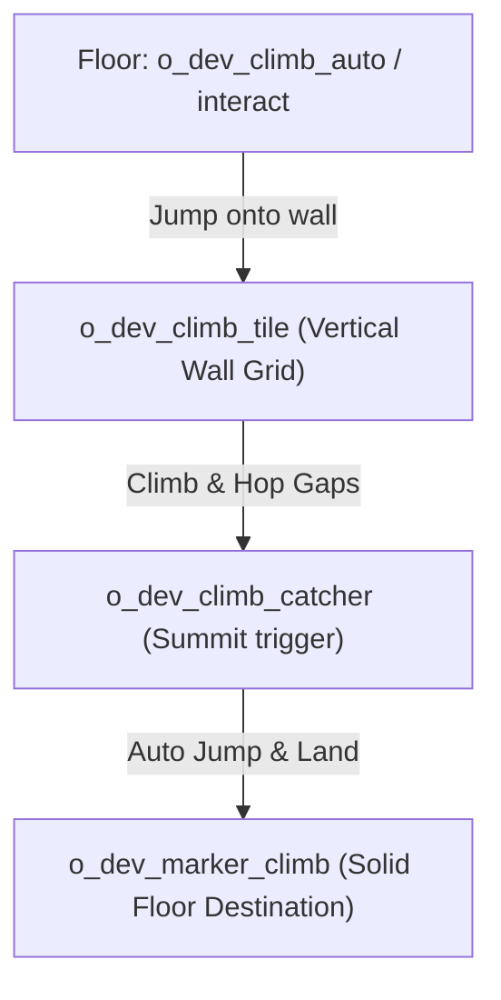

# Climbing and traversal

DELTARUNE Chapter 2 introduced vertical climbing sections — Kris scaling towering book shelves, castle spires, and wire fences while followers wait or cheer from below. tlDR Engine includes a dedicated, physics-based **Climbing System** (`scripts/climb/climb.gml`, `objects/o_dev_climb_controller/`) that handles vertical movement, wall hopping, falling physics, and smooth entry/exit transitions.

This chapter explains how to construct climbing walls, wire up automatic and interactive start triggers, handle summit landings, and customize climb mechanics.

---

## How climbing works in the engine

When the player enters climbing mode, the engine shifts movement rules from top-down walking to a 2D wall-grid:

1. **Leader transitions:** The party leader switches to their climbing sprite (`s_climb`, e.g. `spr_kris_climb`) and faces upward.
2. **Followers fade out:** Other party members smoothly fade out (`party_fade_out()`) so they do not clutter the vertical climb.
3. **Wall grid navigation:** The leader moves freely across instances of `o_dev_climb_tile`. If the player reaches an edge, they can leap across gaps to nearby climb tiles.
4. **Summit exit:** Touching an exit catcher (`o_dev_climb_catcher`) or calling `climb_stop_nearest()` makes the leader jump onto the landing marker (`o_dev_marker_climb`), reassembles the party, and restores normal walking.

---

## The five climbing objects

| Object | Layer | Purpose |
|---|---|---|
| **`o_dev_climb_tile`** | `collisions` (depth 0) | Defines the climbable surface area. Stretch these across your background wall. |
| **`o_dev_climb_auto`** | `Instances` (depth 300) | A floor trigger that **automatically** launches the player onto the wall upon stepping on it. |
| **`o_dev_climb_interact`** | `Instances` (depth 300) | An interactable trigger requiring the player to press **[CONFIRM]** to start climbing. |
| **`o_dev_climb_catcher`** | `Instances` (depth 300) | Placed at the top or bottom of a climb path to detect arrival and trigger exit. |
| **`o_dev_marker_climb`** | `Instances` (depth 300) | The exact spot where the player lands on solid ground after finishing a climb. |

---

## Building a climb section step-by-step

Let's build a vertical tower climb inspired by `room_test_climbing`.



### Step 1 — Lay out the climbable tiles (`o_dev_climb_tile`)

1. Open your room in the GameMaker Room Editor.
2. Select your `collisions` instance layer (depth `0`).
3. Drag instances of **`o_dev_climb_tile`** over the walls or structures the player is allowed to grip.
4. Stretch `scaleX` and `scaleY` to cover the entire climbable surface.

Each `o_dev_climb_tile` has two built-in variables (`objects/o_dev_climb_tile/Create_0.gml`):

```gml
can_climb = true;        // Set to false in Creation Code to create slippery/unclimbable zones
display_outline = true;  // Highlights the grip border in debug mode
```

### Step 2 — Place the entrance trigger

Choose between automatic entry or prompt-based entry:

#### Option A: Automatic entry (`o_dev_climb_auto`)
Place `o_dev_climb_auto` at the base of the wall. When the player walks onto this trigger, the engine automatically calls `climb_start_nearest()`:

```gml
// The player hops with a "swoosh" sound onto the nearest o_dev_climb_tile
climb_start_nearest();
```

#### Option B: Interactive prompt (`o_dev_climb_interact`)
If the climb should only start when the player investigates a ladder or vine, place `o_dev_climb_interact`. The player must stand next to it and press `[Z]` / `[ENTER]`.

### Step 3 — Place the exit catcher and landing marker

At the top of your climbing path:

1. Place an instance of **`o_dev_climb_catcher`** at the top edge of the climbable tiles.
2. Place an instance of **`o_dev_marker_climb`** on the solid floor just beyond the ledge where Kris should land.

When the leader climbs into the catcher's bounding box, `climb_stop_nearest()` fires automatically:
- The leader hops cleanly onto the `o_dev_marker_climb`.
- Normal top-down movement is restored.
- Followers fade back in and line up behind the leader (`party_fade_in()`).

---

## Climbing controls & mechanics

The climbing controller (`objects/o_dev_climb_controller/`) manages physics while on the wall:

| Action | Control | Engine behavior |
|---|---|---|
| **Up / Down / Left / Right** | Arrow Keys | Crawls across adjacent `o_dev_climb_tile` instances (`move_reach = 23`). |
| **Wall Leap** | Direction + Tap | Jumps across gaps to another climb tile up to `jump_reach_max = 50` px away. |
| **Speed Boost / Dash** | Run Key | Accelerates climbing speed temporarily (`speed_boost_timer`). |
| **Falling** | Release grip | If the player moves into empty space without an adjacent tile, gravity applies (`leader_gravity = 0.2`, `leader_terminal_velocity = 6`). |

---

## Scripting custom climb events

You can inspect or trigger climbing states from your own GML scripts:

```gml
// Check if the player is currently climbing
if climb_check() {
    // Disable certain menus or hazards during climb
}

// Programmatically start a climb towards the closest wall
climb_start_nearest();

// Programmatically eject the player to the nearest ground marker
climb_stop_nearest();
```

---

## Slippery surfaces and hazards

To create obstacles on the climbing wall (such as crumbling bricks or electric hazards):

1. Place an `o_dev_climb_tile` over the hazard.
2. In its **Instance Creation Code**, set `can_climb = false`:

```gml
can_climb = false;
```

When Kris attempts to move onto this tile, they will lose their grip and slide downward until grabbing a valid climb tile below or hitting the ground catcher.

---

## Common problems

| Symptom | Cause |
|---|---|
| Player walks past the wall without climbing | `o_dev_climb_auto` trigger was not placed at the floor entry, or `o_dev_climb_tile` is too far away |
| Calling `climb_stop_nearest()` crashes the game | Missing `o_dev_marker_climb` in the room — the engine cannot find a landing destination |
| Player gets stuck at the top ledge and cannot walk | `o_dev_climb_catcher` is missing or does not overlap the top `o_dev_climb_tile` |
| Followers remain invisible after climbing | `climb_stop_nearest()` was bypassed or `party_fade_in()` was not called |
| Player cannot jump across a gap | Gap between `o_dev_climb_tile` instances exceeds `jump_reach_max` (50 pixels) |
