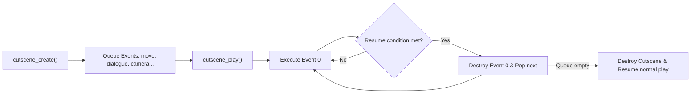

# Cutscenes and camera

In tlDR Engine, cinematic sequences are not hardcoded timers or complex timeline assets. They are built using a clean, asynchronous **event queue** (`scripts/cutscenes/cutscenes.gml`). You queue up a list of actions — dialogues, actor movements, sound effects, camera pans, variable changes — and the engine executes them sequentially frame-by-frame.

This chapter covers how the cutscene sequencer works, how to command party members, how to choreograph the camera, and how to make events trigger only once using the memory system.

---

## How the cutscene queue works

When you call `cutscene_create()`, the engine instantiates a `cutscene` struct (`scripts/cutscenes/cutscenes.gml:3`) and binds it as `global.current_cutscene`. Every subsequent `cutscene_*` helper pushes an event into its internal `queue` array.

When you call `cutscene_play()`, the engine starts a continuous `time_source` loop:



Each event has four optional stages (`scripts/cutscene_events/cutscene_events.gml:6`):
1. **`call`**: Executed immediately when the event begins.
2. **`step`**: Executed every single frame while the event is active.
3. **`resume_condition`**: A function returning `true` when the event is finished (e.g. when a dialogue window closes or an actor arrives at its destination).
4. **`finish`**: Executed right before the event is deleted from memory.

---

## The fundamental rule: always open and close cleanly

Every cutscene trigger follows this mandatory structure:

```gml
cutscene_create();
cutscene_player_canmove(false); // 1. Freeze player input
cutscene_party_follow(false);   // 2. Detach followers so they don't fight custom movement

// --- Your events go here ---

cutscene_party_follow(true);    // 3. Reattach party
cutscene_party_interpolate();   // 4. Snap party trail history cleanly to new positions
cutscene_player_canmove(true);  // 5. Restore player input
cutscene_play();                // 6. Launch the queue
```

!!! danger "Never forget `cutscene_play()`"
    Calling `cutscene_create()` and queuing actions does nothing on its own. If you forget `cutscene_play()` at the end of your trigger code, the events will sit in the queue forever and the player will walk away.

---

## 1. Dialogue in cutscenes

Unlike standard NPC interactions, cutscenes allow you to sequence dialogue boxes precisely between movements and animations (`scripts/cutscene_events/cutscene_events.gml:218`).

### Synchronous dialogue (Wait for confirm)

By default, `cutscene_dialogue()` pauses the entire queue until the player finishes reading and dismisses the box:

```gml
cutscene_dialogue([
    "{char(susie, 4)}* Hey Kris... what is this place?",
    "{char(ralsei, 2)}* It looks like an ancient altar, Susie!"
]);
```

### Asynchronous dialogue (Talk while moving)

Pass `wait = false` as the third parameter to spawn the text box while subsequent queue events continue executing:

```gml
// Susie starts talking, but the cutscene immediately continues to the walk step
cutscene_dialogue("{char(susie, 7)}* Outta my way!", "{e}", false);
cutscene_actor_move(party_get_inst("susie"), new actor_movement(320, 240, 4));
cutscene_wait_dialogue_finish(); // Explicitly wait here before the next scene
```

### Waiting for specific dialogue boxes

If an array has multiple dialogue lines, you can wait for a specific number of boxes to be read using `cutscene_wait_dialogue_boxes(n)`:

```gml
cutscene_dialogue([
    "{char(susie, 0)}* Line 1...",
    "{char(susie, 2)}* Line 2...",
    "{char(susie, 7)}* Line 3..."
], "{p}{e}", false);

cutscene_wait_dialogue_boxes(2); // Wait until player presses confirm past Line 2
cutscene_audio_play(snd_bell);   // Play a sound effect on Line 3
cutscene_wait_dialogue_finish();
```

---

## 2. Moving actors and party members

To move characters smoothly during a scene, use `cutscene_actor_move()` with the `actor_movement` struct (`scripts/actors_scr/actors_scr.gml:48`).

### Finding party members

Get instance IDs reliably with `party_get_inst(name)` or `get_leader()`:

```gml
var susie_inst = party_get_inst("susie");
var ralsei_inst = party_get_inst("ralsei");
var leader_inst = get_leader();
```

### Linear movement (`actor_movement`)

```gml
/// actor_movement(target_x, target_y, [speed], [relative], [ease], [facing_dir])
cutscene_actor_move(
    party_get_inst("susie"), 
    new actor_movement(400, 220, 3, false, "linear", DIR.RIGHT)
);
```

### Jumping into position (`actor_movement_jump_into`)

For dramatic entrances or hopping over ledges:

```gml
/// actor_movement_jump_into(target_x, target_y, jump_up, frames, [relative])
cutscene_actor_move(
    get_leader(),
    new actor_movement_jump_into(300, 240, true, 20, false)
);
cutscene_audio_play(snd_jump);
```

---

## 3. Controlling sprites and animations

While a character is in a cutscene, you often need them to express emotion, face a direction, or play a custom sprite.

### Facing direction

```gml
cutscene_set_variable(party_get_inst("susie"), "dir", DIR.LEFT);
cutscene_set_variable(party_get_inst("noelle"), "dir", DIR.RIGHT);
```

### Overriding standard walk cycles (`cutscene_actor_override`)

Actors automatically try to update their sprite based on their facing direction and movement. When you want an actor to play a fixed sprite (e.g. crossing arms, kneeling, or blushing), enable `s_override`:

```gml
// 1. Tell the actor system not to overwrite sprite_index
cutscene_actor_override(party_get_inst("susie"), true);

// 2. Set the custom sprite
cutscene_set_variable(party_get_inst("susie"), "sprite_index", spr_susie_arm_cross);
cutscene_set_variable(party_get_inst("susie"), "image_speed", 0);

// 3. Deliver line
cutscene_dialogue("{char(susie, 26)}* Heh. You might want to sit down for this.");

// 4. Restore normal sprite control when done
cutscene_actor_override(party_get_inst("susie"), false);
```

---

## 4. Camera choreography

By default, the global camera (`o_camera`) locks onto `get_leader()`. In cutscenes, you can detach the camera and glide it anywhere across the room.

### Panning the camera (`camera_pan`)

```gml
// Detach target so camera doesn't fight the pan
cutscene_set_variable(o_camera, "target", noone);

// Pan to coordinates (x, y, duration_frames, easing)
cutscene_camera_pan(800, 300, 60, "sine_out");
cutscene_sleep(40); // Linger on the focal point for 40 frames

// Return camera to the party leader
cutscene_camera_pan(get_leader().x, get_leader().y, 30, "sine_in_out");
cutscene_set_variable(o_camera, "target", get_leader());
```

### Locking an axis

If you only want horizontal camera movement in a vertical hallway:

```gml
cutscene_set_variable(o_camera, "follow_y", false);
```

---

## 5. Running arbitrary GML (`cutscene_func`)

You can execute any GML function or inline lambda at an exact point in the queue using `cutscene_func(fn, [args])`:

```gml
// Play music
cutscene_func(music_play, [mus_ex_church]);

// Spawn a visual effect or particle
cutscene_func(function() {
    instance_create(o_eff_generic_animation, 400, 200, 0, {
        sprite_index: spr_eff_slidedust
    });
});

// Heal the party
cutscene_func(function() {
    party_heal("kris", 50);
});
```

---

## 6. One-time cutscenes with Memory

Most cutscenes should only happen once when the player steps into an area. The engine provides `memory_get(category, key)` and `memory_set(category, key, value)` (`scripts/memories/memories.gml`).

Place an `o_trigger` on the `Instances` layer and write this in its **Creation Code**:

```gml
// If this cutscene already played in this save file, destroy the trigger immediately
if memory_get("cutscenes", id) {
    instance_destroy();
    exit;
}

trigger_code = function() {
    // Flag this cutscene as complete
    memory_set("cutscenes", id, true);
    
    cutscene_create();
    cutscene_player_canmove(false);
    cutscene_party_follow(false);
    
    // Susie walks forward
    cutscene_actor_move(party_get_inst("susie"), new actor_movement(x + 60, y, 3));
    cutscene_dialogue([
        "{char(susie, 0)}* Look at this place.",
        "{char(susie, 2)}* We must be getting close."
    ]);
    
    cutscene_party_follow(true);
    cutscene_party_interpolate();
    cutscene_player_canmove(true);
    cutscene_play();
    
    // Destroy the trigger instance so it cannot be touched again in this room visit
    instance_destroy();
};
```

---

## Complete walkthrough: A team discovery scene

Here is a full cutscene script inspired by `room_test_cutscene` (`rooms/room_test_cutscene/InstanceCreationCode_inst_3CB25A36.gml`):

```gml
trigger_code = function() {
    cutscene_create();
    cutscene_player_canmove(false);
    cutscene_party_follow(false);
    
    var susie = party_get_inst("susie");
    var noelle = party_get_inst("noelle");
    var leader = get_leader();
    
    // 1. Position party members
    cutscene_set_variable(susie, "dir", DIR.LEFT);
    cutscene_set_variable(noelle, "dir", DIR.RIGHT);
    
    // 2. Dialogue with emotion portraits
    cutscene_dialogue([
        "{char(susie, 4)}* If you were dreaming this whole time...",
        "{char(susie, 4)}* Why is your HP not full??",
        "{char(noelle, 1)}* Oh! Do you have any items?"
    ]);
    
    // 3. Susie steps forward and casts a spell
    cutscene_actor_override(susie, true);
    cutscene_set_variable(susie, "sprite_index", spr_susie_heal);
    cutscene_audio_play(snd_spellcast);
    cutscene_sleep(15);
    
    // 4. Create visual healing beam
    cutscene_func(function(susie, noelle) {
        var beam = instance_create(o_dummy, susie.x + 20, susie.y - 20, susie.depth - 10, {
            sprite_index: spr_eff_healsparkle
        });
        animate(beam.x, noelle.x, 25, "linear", beam, "x");
    }, [susie, noelle]);
    
    cutscene_sleep(25);
    cutscene_func(party_heal, ["noelle", 40]);
    cutscene_audio_play(snd_heal);
    
    // 5. Wrap up
    cutscene_actor_override(susie, false);
    cutscene_dialogue([
        "{char(noelle, 4)}* Um, thanks Susie! That felt refreshing!"
    ]);
    
    cutscene_party_follow(true);
    cutscene_party_interpolate();
    cutscene_player_canmove(true);
    cutscene_play();
};
```

---

## Common problems

| Symptom | Cause |
|---|---|
| Cutscene does nothing when triggered | Missing `cutscene_play()` at the end of the script |
| Party members teleport or jitter after the scene | Forgot to call `cutscene_party_interpolate()` when re-enabling `cutscene_party_follow(true)` |
| Player can walk away during dialogue | Missing `cutscene_player_canmove(false)` |
| Actor walks in place forever | The `target_x` or `target_y` in `actor_movement` is inside an `o_block` collision |
| Sprite change is ignored by the character | Did not call `cutscene_actor_override(inst, true)` before setting `sprite_index` |
| Cutscene repeats every time you walk into the room | Did not save memory state with `memory_set("cutscenes", id, true)` and check `memory_get(...)` |
| Camera snaps violently instead of panning smoothly | Forgot to set `o_camera.target = noone` before calling `cutscene_camera_pan()` |
