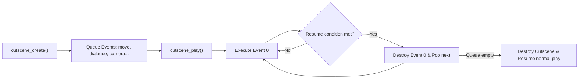
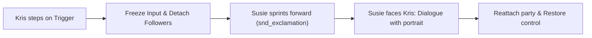

# Cutscenes and camera

In tlDR Engine, cinematic sequences are not hardcoded timers or complex timeline assets. They are built using an asynchronous **event queue** (`scripts/cutscenes/cutscenes.gml`). You queue up a list of actions — dialogues, actor movements, sound effects, camera pans, variable changes — and the engine executes them sequentially frame-by-frame.

This chapter covers how the cutscene sequencer works, followed by a step-by-step tutorial to build your first scripted cutscene from scratch, and advanced camera choreography techniques.

---

## How the cutscene queue works

When you call `cutscene_create()`, the engine instantiates a `cutscene` struct (`scripts/cutscenes/cutscenes.gml:3`) and binds it as `global.current_cutscene`. Every subsequent `cutscene_*` helper pushes an event into its internal `queue` array.

When you call `cutscene_play()`, the engine starts a continuous `time_source` loop:



Each event has four optional stages (`scripts/cutscene_events/cutscene_events.gml:6`):
1. **`call`**: Executed immediately when the event begins.
2. **`step`**: Executed every single frame while the event is active.
3. **`resume_condition`**: A function returning `true` when the event is finished (e.g. when a dialogue window closes or an actor arrives at its destination).
4. **`finish`**: Executed right before the event is deleted from memory.

---

## The fundamental rule: always open and close cleanly

Every cutscene trigger follows this mandatory structure:

```gml
cutscene_create();
cutscene_player_canmove(false); // 1. Freeze player input
cutscene_party_follow(false);   // 2. Detach followers so they don't fight custom movement

// --- Your scripted events go here ---

cutscene_party_follow(true);    // 3. Reattach party followers
cutscene_party_interpolate();   // 4. Snap follower trail history cleanly to new positions
cutscene_player_canmove(true);  // 5. Restore player input
cutscene_play();                // 6. Launch the queue
```

!!! danger "Never forget `cutscene_play()`"
    Calling `cutscene_create()` and queuing actions does nothing on its own. If you forget `cutscene_play()` at the end of your trigger code, the events will sit in the queue forever and the player will walk away.

---

## Tutorial: Your first cutscene in 6 steps

Let's build a simple, classic DELTARUNE scene: as Kris walks down a hallway, Susie spots something, breaks formation, sprints ahead, turns around to face Kris, says a line with an emotion portrait, and then rejoins the party. The scene will only play once per save file.



### Step 0 — Place the trigger object in your room

1. Open your room in the GameMaker Room Editor (e.g. the sanctuary you built in [Your first room](your-first-room.md)).
2. Select your **`Instances`** layer (depth `300`).
3. Drag an instance of **`o_trigger`** onto the floor where the event should occur.
4. Stretch its bounding box (`scaleX` and `scaleY`) so Kris cannot walk past without touching it.

### Step 1 — Prevent repeat execution with memory

Double-click the `o_trigger` instance to open its **Instance Creation Code**.

Add a check at the very top using the engine's memory system (`scripts/memories/memories.gml`):

```gml
// If this cutscene already triggered in this save file, destroy the trigger immediately
if memory_get("cutscenes", id) {
    instance_destroy();
    exit;
}
```

### Step 2 — Define `trigger_code` and lock controls

When Kris walks into the trigger, we record the memory flag and lock the player's movement:

```gml
trigger_code = function() {
    // 1. Mark as completed in save memory
    memory_set("cutscenes", id, true);
    
    // 2. Open the cutscene queue
    cutscene_create();
    cutscene_player_canmove(false); // Lock arrow keys
    cutscene_party_follow(false);   // Detach Susie/Ralsei from automatic following
```

### Step 3 — Move Susie and play an alert sound

We locate Susie using `party_get_inst("susie")`, play an exclamation sound, and command her to sprint 60 pixels ahead of Kris:

```gml
    var susie = party_get_inst("susie");
    var leader = get_leader();
    
    // Play alert sound and move Susie forward
    cutscene_audio_play(snd_exclamation);
    cutscene_actor_move(susie, new actor_movement(leader.x + 60, leader.y, 20,,, DIR.RIGHT));
    cutscene_sleep(10); // Brief pause when she stops
```

### Step 4 — Turn around and deliver dialogue

Once Susie arrives, she turns around to face Kris (`DIR.LEFT`) and delivers a dialogue box with her characteristic portrait:

```gml
    // Turn Susie to face left towards Kris
    cutscene_set_variable(susie, "dir", DIR.LEFT);
    
    // Deliver dialogue with portrait 4 (smug/curious)
    cutscene_dialogue([
        "{char(susie, 4)}* Hey Kris... you felt that breeze, right?",
        "{char(susie, 2)}* Something big is up ahead. Let's move!"
    ]);
```

### Step 5 — Reassemble the party and start playback

Finally, re-enable party following, snap their history trail cleanly, restore movement, and call `cutscene_play()`:

```gml
    // 3. Clean wrap-up
    cutscene_party_follow(true);
    cutscene_party_interpolate();   // Critical: prevents followers from snapping/teleporting
    cutscene_player_canmove(true);  // Restore player movement
    cutscene_play();                // Execute the entire queue!
    
    // Destroy the trigger instance so it won't fire again in this room visit
    instance_destroy();
};
```

### Step 6 — The complete trigger code & test checklist

Here is the entire script inside your `o_trigger` Creation Code:

```gml
// Instance Creation Code of o_trigger in your room
if memory_get("cutscenes", id) {
    instance_destroy();
    exit;
}

trigger_code = function() {
    memory_set("cutscenes", id, true);
    
    cutscene_create();
    cutscene_player_canmove(false);
    cutscene_party_follow(false);
    
    var susie = party_get_inst("susie");
    var leader = get_leader();
    
    cutscene_audio_play(snd_exclamation);
    cutscene_actor_move(susie, new actor_movement(leader.x + 60, leader.y, 20,,, DIR.RIGHT));
    cutscene_sleep(10);
    
    cutscene_set_variable(susie, "dir", DIR.LEFT);
    cutscene_dialogue([
        "{char(susie, 4)}* Hey Kris... you felt that breeze, right?",
        "{char(susie, 2)}* Something big is up ahead. Let's move!"
    ]);
    
    cutscene_party_follow(true);
    cutscene_party_interpolate();
    cutscene_player_canmove(true);
    cutscene_play();
    
    instance_destroy();
};
```

Run your game (`F5`) and test the scene:
- [ ] Walking into the trigger locks player controls immediately.
- [ ] Susie sprints 60px ahead with `snd_exclamation`.
- [ ] Susie turns left and displays her dialogue box with portrait.
- [ ] Dismissing the dialogue returns control smoothly to Kris.
- [ ] Susie steps back into follower formation without glitching or teleporting.
- [ ] Leaving and re-entering the room does **not** replay the cutscene.

---

## Core building blocks & advanced techniques

Once you understand the basic queue, you can combine these building blocks to craft complex cinematics.

### 1. Dialogue control in cutscenes

Unlike standard NPC dialogue, cutscenes offer granular timing (`scripts/cutscene_events/cutscene_events.gml:218`).

#### Asynchronous dialogue (Talk while walking)
Pass `wait = false` to spawn the text box while subsequent queue events continue executing simultaneously:

```gml
// Susie delivers a line while walking forward
cutscene_dialogue("{char(susie, 7)}* Outta my way!", "{e}", false);
cutscene_actor_move(party_get_inst("susie"), new actor_movement(320, 240, 30));
cutscene_wait_dialogue_finish(); // Explicitly pause here until the text box closes
```

#### Waiting for specific dialogue boxes
If an array contains multiple text boxes, pause the queue until a specific box is reached:

```gml
cutscene_dialogue([
    "{char(susie, 0)}* Box 1...",
    "{char(susie, 2)}* Box 2...",
    "{char(susie, 7)}* Box 3..."
], "{p}{e}", false);

cutscene_wait_dialogue_boxes(2); // Wait until player confirms past Box 2
cutscene_audio_play(snd_bell);   // Sound plays on Box 3
cutscene_wait_dialogue_finish();
```

---

### 2. Actor movement styles

Use `cutscene_actor_move()` with movement structs (`scripts/actors_scr/actors_scr.gml:98`):

#### Walking movement (`actor_movement`)

Constructor signature:
```gml
new actor_movement(_x, _y, _time, _seed = "", _spd = undefined, _char_dir = undefined, _absolute = true, _play_sfx = true)
```

- `_x`, `_y`: Target X and Y positions (or relative offsets if `_absolute = false`).
- `_time`: Duration of the movement in frames (e.g. `20` or `30`). When `_spd` is left `undefined`, the engine automatically computes walking speed based on distance / time.
- `_seed`: Animation seed string (`""` default for walking, `"jump"`, `"jump_into"`).
- `_spd`: Speed constraint. Leave `undefined` (or use commas `,,,`) to constrain by `_time`.
- `_char_dir`: Optional facing direction locked during movement (`DIR.UP`, `DIR.DOWN`, `DIR.LEFT`, `DIR.RIGHT`), or `undefined` to face movement angle automatically.
- `_absolute`: Whether coordinates are absolute room positions (`true`, default) or relative offsets from current position (`false`).
- `_play_sfx`: Whether to play sound effects (default `true`).

```gml
// Walk to absolute position (400, 220) in 30 frames, facing right:
cutscene_actor_move(
    party_get_inst("susie"), 
    new actor_movement(400, 220, 30,,, DIR.RIGHT)
);

// Walk 60 pixels to the right relative to current position in 20 frames:
cutscene_actor_move(
    party_get_inst("susie"), 
    new actor_movement(60, 0, 20,,, DIR.RIGHT, false)
);
```

#### Jumping movement (`actor_movement_jump` & `actor_movement_jump_into`)

Jump constructors inherit from `actor_movement`:
```gml
new actor_movement_jump(_x, _y, _absolute = true, _time = 15, _play_sfx = true)
new actor_movement_jump_into(_x, _y, _absolute = true, _time = 15, _play_sfx = true)
```

- `actor_movement_jump`: Jumps and plays the landing animation (`s_landed`).
- `actor_movement_jump_into`: Jumps without landing animation (ideal for transitions or climbing onto ledges). Both play `snd_jump` automatically if `_play_sfx` is `true`.

```gml
// Jump to absolute (300, 240) in 20 frames:
cutscene_actor_move(
    get_leader(),
    new actor_movement_jump_into(300, 240, true, 20)
);
```

---

### 3. Sprite overrides & custom animations

Actors automatically try to update their sprite based on walk cycles. To display a custom pose (e.g. crossing arms, kneeling, or casting a spell), set `s_override` using `cutscene_actor_override()`:

```gml
// 1. Tell the actor system not to overwrite sprite_index
cutscene_actor_override(party_get_inst("susie"), true);

// 2. Set the custom sprite
cutscene_set_variable(party_get_inst("susie"), "sprite_index", spr_susie_arm_cross);
cutscene_set_variable(party_get_inst("susie"), "image_speed", 0);

// 3. Deliver line
cutscene_dialogue("{char(susie, 26)}* Heh. You might want to sit down for this.");

// 4. Restore normal sprite control
cutscene_actor_override(party_get_inst("susie"), false);
```

---

### 4. Camera choreography

By default, the global camera (`o_camera`) locks onto `get_leader()`. In cutscenes, you can detach the camera and glide it anywhere across the room.

```gml
// 1. Detach target so camera doesn't fight the pan
cutscene_set_variable(o_camera, "target", noone);

// 2. Pan to focal point (x_dest, y_dest, time, wait = true, ease_type = "linear")
cutscene_camera_pan(800, 300, 60, true, "sine_out");
cutscene_sleep(40); // Linger on the landmark for 40 frames

// 3. Return camera to party leader and rebind
cutscene_camera_pan(get_leader().x, get_leader().y, 30, true, "sine_in_out");
cutscene_set_variable(o_camera, "target", get_leader());
```

---

### 5. Running arbitrary GML (`cutscene_func`)

You can execute any custom GML function or inline lambda at an exact point in the queue:

```gml
// Play music
cutscene_func(music_play, [mus_ex_church]);

// Spawn a visual effect or particle
cutscene_func(function() {
    instance_create(o_eff_generic_animation, 400, 200, 0, {
        sprite_index: spr_eff_slidedust
    });
});

// Heal party member
cutscene_func(party_heal, ["kris", 50]);
```

---

## Common problems

| Symptom | Cause |
|---|---|
| Cutscene does nothing when triggered | Missing `cutscene_play()` at the end of the script |
| Party members teleport or jitter after the scene | Forgot to call `cutscene_party_interpolate()` when re-enabling `cutscene_party_follow(true)` |
| Player can walk away during dialogue | Missing `cutscene_player_canmove(false)` |
| Actor walks in place forever | The `target_x` or `target_y` in `actor_movement` is inside an `o_block` collision |
| Sprite change is ignored by the character | Did not call `cutscene_actor_override(inst, true)` before setting `sprite_index` |
| Cutscene repeats every time you walk into the room | Did not save memory state with `memory_set("cutscenes", id, true)` and check `memory_get(...)` |
| Camera snaps violently instead of panning smoothly | Forgot to set `o_camera.target = noone` before calling `cutscene_camera_pan()` |
