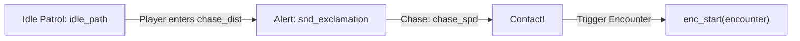

# Hazards, chases, and dodging

Overworld gameplay in DELTARUNE is dynamic and hazardous: enemies roam along patrol paths, spot the party with an exclamation mark, and chase you down. Furthermore, certain areas switch into a **real-time bullet-dodging mode** directly on the map — dodging speeding cars in Cyber City or dancing shadows in the Forest without opening the turn-based battle screen.

tlDR Engine implements both systems:
1. **Enemy Overworld Actors** (`o_actor_e`, `o_trigger_enemy_chase`) — patrol paths, line-of-sight chasing, and battle initialization.
2. **Overworld Dodging System** (`scripts/dodge/dodge.gml`, `o_trigger_dodge`, `o_dodge_controller`) — real-time red SOUL control, ambient bullet collision, and map darken shaders.

---

## 1. Overworld enemy actors (`o_actor_e`)

An enemy on the map is an instance of **`o_actor_e`** (or a specialized child like `o_actor_e_killercar` or `o_actor_e_virovirokun`).



### Configurable Variable Definitions

Every `o_actor_e` instance exposes these key variables in the GameMaker Inspector (`objects/o_actor_e/Create_0.gml`):

| Variable | Type | Default | Description |
|---|---|---|---|
| **`encounter`** | Expression | `new enc_set_ex()` | The encounter struct initialized when the enemy touches the party. |
| **`idle_path`** | Path Asset | `noone` | A GameMaker Path resource the enemy follows back and forth while idle. |
| **`idle_path_spd`** | Real | `2` | Speed along the idle path. |
| **`chase_dist`** | Real | `60` | Detection radius in pixels. If the leader enters this radius, chase begins. |
| **`chase_spd`** | Real | `4` | Movement speed while pursuing the player. |
| **`idle_path_autopos`** | Boolean | `true` | Snaps the enemy to the nearest point along its path on room start. |

### Adding an enemy to your room

1. Place `o_actor_e` on the `Instances` layer.
2. In its **Variable Definitions**, assign your encounter:
   ```gml
   encounter = new enc_set_my_custom_fight();
   ```
3. (Optional) Assign a Path asset to `idle_path` so the enemy paces back and forth along a hallway.

### Zone-based chasing with `o_trigger_enemy_chase`

Instead of relying purely on circular distance, you can define an entire ambush room using **`o_trigger_enemy_chase`**.

1. Place `o_trigger_enemy_chase` and stretch its bounding box across a doorway or corridor.
2. When the player steps into the trigger, every `o_actor_e` linked to the area alerts (`snd_exclamation`) and begins sprinting toward the party leader.

---

## 2. Real-time overworld dodging (`o_trigger_dodge`)

In rooms like `room_ex_city` and `room_ex_dforest`, the party encounters hazards that damage HP in real-time.

When dodging mode is enabled:
- The screen subtly darkens (`dodge_darken_self()`).
- Kris's red **SOUL** appears over the leader (`o_dodge_soul`).
- Grazing and damage mechanics activate in the overworld.
- If party HP reaches zero, the engine executes `dodge_gameover()`, captures a freeze-frame surface, and transitions to `room_gameover`.

### Setting up a dodge zone

1. Select the `Instances` layer.
2. Place an instance of **`o_trigger_dodge`** and scale it over the hazard zone (e.g. a street crossing or a puzzle floor).
3. That is it! `o_trigger_dodge` automatically handles entering and leaving:

```gml
// objects/o_trigger_dodge/Create_0.gml
trigger_code = function() {
    dodge_on(); // Spawns o_dodge_soul and turns on hazard collision
};

trigger_exit_code = function() {
    dodge_off(); // Removes SOUL and restores normal overworld state
};
```

---

## 3. Creating overworld bullets & hazards

Any object that should damage the player during overworld dodging inherits from **`o_dodge_bullet`** (`objects/o_dodge_bullet/`).

### How `o_dodge_bullet` works

`o_dodge_bullet` automatically handles collision with `o_dodge_soul`:
- **Collision:** Plays `snd_hurt`, reduces leader HP, flashes the SOUL with invulnerability frames (`inv = 30`), and screenshakes.
- **Graze:** If the SOUL passes close to the bullet, plays `snd_graze` and grants TP.

### Example: A moving traffic car hazard

Here is how the speeding cars in `room_ex_city` (`objects/o_ex_ow_city_traffic_car/`) are constructed:

```gml
// Create Event
event_inherited(); // Inherits o_dodge_bullet collision
spd = 6;
dir = DIR.LEFT;

// Step Event
x += lengthdir_x(spd, dir * 90);
y += lengthdir_y(spd, dir * 90);

// Destroy when offscreen
if x < -50 || x > room_width + 50
    instance_destroy();
```

### Example: Spawning waves of hazards along paths

In `room_ex_dforest`, dancing shadow monsters spawn along paths using `o_ex_dodge_dforest_dancerspawn`:

```gml
// Instance Creation Code of the spawner
path = path_ex_dforest_dancers1;
pattern = [1, 1, 0, 1, 0, 0, 1]; // 1 = spawn dancer, 0 = gap
```

---

## 4. Darkening objects during overworld battles

To make trees, signs, and background props react to the overworld dodge mode (dimming when the battle zone activates), call `dodge_darken_self()` in their **Draw Event**:

```gml
// Draw Event of custom overworld prop
draw_self();
dodge_darken_self(); // Applies dark overlay when dodge_mode is active
```

---

## Overworld Game Over (`dodge_gameover`)

If the party leader takes fatal damage during overworld dodging:

```gml
// scripts/dodge/dodge.gml:34
function dodge_gameover() {
    // 1. Captures application_surface as a frozen screenshot
    // 2. Plays snd_hurt and cuts music
    // 3. Spawns o_gameover soul shatter effect
    // 4. Transitions directly to room_gameover
}
```

This guarantees an immediate, seamless game-over sequence matching DELTARUNE's exact presentation.

---

## Common problems

| Symptom | Cause |
|---|---|
| Enemy touches player but battle never starts | `encounter` field on `o_actor_e` is not initialized or invalid |
| Enemy does not chase when player approaches | `chase_dist` is too small, or the enemy is stuck inside an `o_block` collision |
| Red SOUL does not appear in hazard zone | Missing `o_trigger_dodge` or `o_dodge_controller` in the room |
| Dodging remains stuck on after leaving the area | `o_trigger_dodge` was deleted or did not execute `trigger_exit_code` |
| Overworld bullets do not deal damage | The bullet object was not parented to `o_dodge_bullet` |
