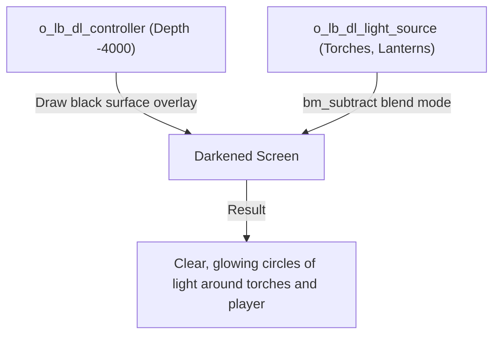

# Lighting and atmosphere

Atmosphere in DELTARUNE is more than tiles and sprites — it is the golden spotlight illuminating a prophecy mural, the gloomy darkness of an ancient cavern pierced by lanterns, the rippling water reflections under the party's boots, and the rhythm of footsteps echoing in an empty hallway.

tlDR Engine provides dedicated subsystems for each of these elements:
1. **Dark Lighting System** (`o_lb_dl_controller`, `o_lb_dl_light_source`) — surface-based dynamic shadows and circular light cones.
2. **Atmospheric Spotlights** (`scripts/lighting/lighting.gml`, `o_eff_lighting_controller`) — colored room fades and altar highlights.
3. **Floor Reflections** (`o_reflection_manager`) — mirrored silhouettes on shiny water or polished marble.
4. **Soundscapes and Borders** (`o_dev_ambiance`, `o_dev_music`, `o_dev_border`).

---

## 1. Dynamic darkness & light sources

In dark zones (like `room_lb_dark_lighting`), the entire room is submerged in darkness, and light only shines where you place light sources.



### Setting up dark lighting

1. Place **`o_lb_dl_controller`** anywhere in your room on the `Instances` layer. It automatically creates a drawing surface at depth `-4000` (above all tiles and actors).
2. Place instances of **`o_lb_dl_light_source`** wherever light should shine (e.g. over street lamps, crystals, or lanterns).
3. Scale `scaleX` and `scaleY` in the Room Editor to adjust the radius of each light circle.
4. Tint `image_blend` to give specific lights warm amber, eerie cyan, or neon purple glows.

---

## 2. Altar spotlights and prophecy highlights

In rooms with dramatic centerpieces (like the prophecy altar in `room_ex_church` or `room_meu_jogo_vila`), the engine allows you to smoothly transition into a focused lighting state.

### Activating lighting via script

Call `lighting_on()` (`scripts/lighting/lighting.gml:4`) inside a trigger or cutscene:

```gml
/// lighting_on(highlight_color, [fade_color])
lighting_on(c_yellow, c_navy);
```

To return to normal:

```gml
lighting_off();
```

### How props react (`lighting_darken_self`)

When `lighting_on()` is called, objects that call `lighting_darken_self()` in their Draw event will darken so the illuminated prop (e.g. `o_ow_prophecy`) stands out brilliantly:

```gml
// Draw Event of background prop
draw_self();
lighting_darken_self();
```

---

## 3. Water and floor reflections (`o_reflection_manager`)

For flooded caverns, shimmering lakes, or polished palace floors, **`o_reflection_manager`** renders mirrored reflections of every character walking above it (`objects/o_reflection_manager/Draw_0.gml`).

### How to use reflections

1. Place **`o_reflection_manager`** in the room on the `Instances` layer.
2. Ensure your actor instances have `can_reflect = true` (standard party members and `o_actor` instances have this enabled by default).
3. Place your water/reflective tiles on the floor.
4. When the party walks near the reflection manager, the engine automatically draws their inverted, semi-transparent sprites below their feet.

---

## 4. Audio ambiance and footsteps (`o_dev_ambiance`)

Small audio cues make the overworld feel alive. Every room can configure footstep sounds and environmental background loops.

### Enabling footstep sounds

Place **`o_dev_ambiance`** on your `Instances` layer and configure its Variable Definitions:

| Variable | Type | Default | Description |
|---|---|---|---|
| **`footsteps`** | Boolean | `true` | When true, walking plays rhythmic footstep audio matching the floor type. |

### Background music (`o_dev_music`)

Place **`o_dev_music`** to set the room's soundtrack:

| Variable | Type | Example | Description |
|---|---|---|---|
| **`mus`** | Sound Asset | `mus_ex_church` | The music track to stream. The engine automatically loops and crossfades it. |

---

## 5. Decorative window borders (`o_dev_border`)

DELTARUNE wraps the 4:3 gameplay viewport with illustrated decorative borders on widescreen displays. Place **`o_dev_border`** to set the active border graphic for the room:

```gml
// Variable Definition: _border_name
_border_name = "border_simple"; // Options: "border_simple", "ex_border_titan", "border_none"
```

---

## Common problems

| Symptom | Cause |
|---|---|
| Darkness surface is completely black and covers lights | Missing `o_lb_dl_light_source` instances, or light sprites have 0 alpha |
| Reflections do not appear on water | `o_reflection_manager` is missing from the room, or distance between actor and manager exceeds 20 px |
| Footsteps do not play when walking | `o_dev_ambiance` missing or `footsteps` variable definition is set to `false` |
| Screen borders are stretched or cut off | Selected border asset name does not match any entry registered in `scripts/borders/borders.gml` |
