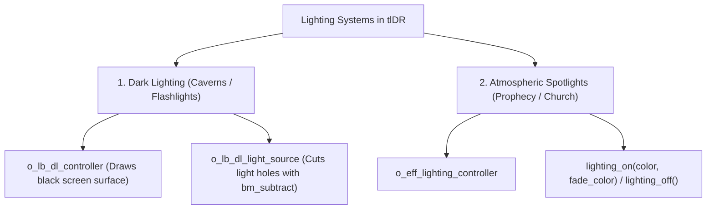

# Lighting and atmosphere

Atmosphere in DELTARUNE is more than tiles and sprites — it is the golden spotlight illuminating a prophecy mural, the gloomy darkness of an ancient cavern pierced by lanterns, the rippling water reflections under the party's boots, and the rhythm of footsteps echoing in an empty hallway.

tlDR Engine implements two distinct lighting systems:
1. **Dark Lighting System (`dark_lighting_ch4`)** — surface-based dynamic shadows where `o_lb_dl_light_source` cuts glowing holes in the dark overlay using `bm_subtract`.
2. **Atmospheric Spotlights (`scripts/lighting/lighting.gml`)** — colored room fades and altar highlights (`lighting_on()`) used during prophecy scenes.

This chapter explains both systems in detail, followed by a step-by-step tutorial to build dark rooms, wall torches, and player-carried lanterns.

---

## The two lighting systems in tlDR



---

## 1. How Dark Lighting works under the hood

The dark lighting system (`folders/@Libraries/dark_lighting_ch4.yy`) consists of two objects:

### `o_lb_dl_controller` (The shadow canvas)
- Sits at depth `-4000` (above all tiles, characters, and decor).
- Creates an offscreen surface (`surf_overlay`) every frame and clears it to semi-transparent black.
- Draws all `o_lb_dl_light_source` instances using **`gpu_set_blendmode(bm_subtract)`** — literally erasing the darkness wherever a light is placed to reveal the game world underneath.

### `o_lb_dl_light_source` (The light cutout / cookie)
- Is marked **`visible = false`** in its object definition so it does not draw during normal room rendering.
- Its sprite acts as a **light mask (cookie)**.
- If placed in a room without a controller, its Create event automatically spawns `o_lb_dl_controller` for you (`objects/o_lb_dl_light_source/Create_0.gml:2`).

---

## Tutorial: Your first dark cavern with torches & lanterns in 6 steps

Let's build a complete dark cavern featuring:
1. Ambient pitch-black darkness.
2. Wall torches with warm amber glows.
3. A mobile lantern attached to Kris that illuminates their path.
4. Reflective water puddles on the floor.
5. An ancient glowing altar.

---

### Step 0 — Prepare the room

1. Create a new room in GameMaker (e.g. `room_dark_cavern`).
2. Add your standard two objects on the `Instances` layer (depth `300`):
   - **`o_dev_world`** (`world = WORLD_TYPE.DARK`)
   - **`o_dev_playermarker`**
3. Draw floor tiles and wall collision blocks (`o_block`).

---

### Step 1 — Create a dedicated Lighting layer

In the GameMaker Room Editor layer list:
1. Create a new **Instance Layer** and name it **`lighting`**.
2. Set its depth to `-100` (or leave it at standard instance depth).

> [!note] Sobre o `o_lb_dl_controller`
> Você não precisa arrastar essa instância na room manualmente. Se a room tiver
> pelo menos um `o_lb_dl_light_source` (ou qualquer objeto que herde dele, como
> o `o_player_torch` do Step 3) e nenhum controller existir ainda, o próprio
> Create Event do light source cria o controller sozinho. Só coloque um
> `o_lb_dl_controller` manualmente se precisar controlar a cor/opacidade do
> overlay escuro global — caso contrário, ignore esse objeto por completo.

---

### Step 2 — Place and configure static wall torches (`o_lb_dl_light_source`)

1. Drag an instance of **`o_lb_dl_light_source`** from the Asset Browser onto your `lighting` layer, directly over a torch or lamp on the wall.
2. Click on the instance in the Room Editor to open the **Inspector**:

#### A. Selecting the Light Sprite (Shape)
In the Inspector's **Sprite** field:
- By default, it uses `spr_default_alt_2` (a soft glowing square/circle).
- You can select any light cookie sprite in your project (such as `spr_lb_dl_ex_window` or your own radial gradient sprite `spr_light_circle_soft`).

#### B. Adjusting Light Radius (Scale)
- Set **`scaleX`** to `2.5` and **`scaleY`** to `2.5` to expand the radius of the light circle.

#### C. Setting Light Color & Intensity
- Click the **Color** swatch in the Inspector and pick an amber/orange tint (`#FFAA33`) for fire, or cool cyan (`#44AAFF`) for magic crystals.
- Adjust **Alpha** (`0.8` to `1.0`) to make the light softer or brighter.

---

### Step 3 — Create a dynamic lantern that follows Kris

If Kris should hold a lantern or flashlight that lights up wherever they walk:

1. In the Asset Browser, create a **Sprite** named **`spr_player_torch_light`**.
   - Draw a soft white circle with a radial gradient (opaque white at the center, fading to transparent at the edges) on a transparent background.
   - Size: **128×128px**, keeping the circle centered in the canvas. `o_lb_dl_light_source` scales this sprite to define the light's shape and falloff, so the base image must already be **pure white** — `image_blend` only tints it, it doesn't generate the gradient for you.
   - **Set the sprite's Origin to Middle Center — this is not optional.** If the origin is left at the GameMaker default (top-left), the light gets a fixed positional bias baked in. Combined with the directional offset in Step 3.5 below, this bias *adds* to the offset in one diagonal (making the light drift too far in that direction) and *cancels it out* in the opposite diagonal (making the light look glued underneath Kris instead of in front). It's an easy bug to misdiagnose as a math error in the offset code, when it's really just the sprite's origin.

2. In the Asset Browser, create an Object named **`o_player_torch`**.
3. Set its **Sprite** to **`spr_player_torch_light`** and its **Parent** to **`o_lb_dl_light_source`**.
4. In its **Create Event**:
```gml
   event_inherited();
   image_xscale = 1.2; // Light radius width
   image_yscale = 1.2; // Light radius height
   image_blend = c_orange;
```

> [!warning] `image_blend` aqui não pinta a luz de laranja
> `o_lb_dl_controller` desenha os light sources com `gpu_set_blendmode(bm_subtract)`
> — ele **subtrai** o RGB do sprite da camada escura, revelando o cenário original
> por baixo, sem adicionar cor nenhuma a ele. `image_blend` muda apenas *quanto*
> cada canal é subtraído (afeta sutilmente o contraste da borda do "buraco"), não
> produz um halo visivelmente laranja. Na prática, para este passo, quase
> qualquer cor aqui dá um resultado visual muito parecido — o efeito de "luz
> quente" de verdade só aparece com um passo extra (uma segunda camada desenhada
> com `bm_add`, explicada logo abaixo).
5. In its **Step Event (End Step)**:
```gml
   // Follow the party leader, offset a bit in front of them
   // based on which way they're currently facing.
   var _leader = get_leader();

   if instance_exists(_leader) {
       var _offset = 40; // how far ahead of Kris the light sits, in pixels
       var _rad = degtorad(_leader.dir);

       // The engine's DIR enum is UP=0, RIGHT=90, DOWN=180, LEFT=270 — a
       // clockwise angle starting from "up", not the standard math convention
       // (0° = right, counter-clockwise) that lengthdir_x/y expect. Plugging
       // _leader.dir straight into lengthdir_x/y silently gets two of the four
       // directions backwards. Converting manually with sin/cos sidesteps that.
       var _offset_x = _offset * sin(_rad);
       var _offset_y = -_offset * cos(_rad);

       x = _leader.x + _offset_x;
       y = _leader.s_get_middle_y() + _offset_y;
   }
```
6. Drag one instance of `o_player_torch` into your room on the `lighting` layer.

Now, as Kris explores the room, a circle of warm lantern light moves with them seamlessly — and shifts ahead of them as they turn to face a new direction!

> [!warning] Não use `lengthdir_x`/`lengthdir_y` com `dir` diretamente
> É tentador escrever `lengthdir_x(_offset, _leader.dir)` — mas o `DIR` da
> engine (`UP=0, RIGHT=90, DOWN=180, LEFT=270`, sentido horário a partir de
> cima) não é o mesmo sistema de ângulos que `lengthdir_x/y` esperam (0° =
> direita, sentido anti-horário). O resultado é um bug sutil e assimétrico:
> a luz parece longe demais indo para direita/baixo, e grudada embaixo do
> Kris indo para esquerda/cima. A conversão manual com `sin`/`cos` acima
> evita esse problema.

> [!tip] Tuning the offset
> `_offset = 40` is a starting point; increase it if the light still looks glued to Kris's back, or decrease it if it drifts too far ahead when they turn a corner.

#### Step 3.5 (optional) — Give the lantern an actual orange tint

Since `image_blend` alone doesn't tint the revealed area (see the warning above), add a second, additively-blended draw pass on top of the cutout to get a real warm glow:

```gml
// Draw Event de o_player_torch
event_inherited(); // deixa o corte de escuridão (bm_subtract) acontecer normalmente

gpu_set_blendmode(bm_add);
draw_sprite_ext(
    spr_player_torch_light,
    image_index,
    x, y,
    image_xscale * 0.6, image_yscale * 0.6, // um pouco menor que o buraco
    0,
    c_orange,
    0.25 // opacidade baixa, senão estoura pra branco
);
gpu_set_blendmode(bm_normal);
```

This draws a translucent orange halo *on top of* the area already revealed by the subtract cutout — giving the warm firelight tone without interfering with the `bm_subtract` mask that makes the cutout itself work.

---

### Step 4 — Add water puddles with reflections (`o_reflection_manager`)

1. Place water floor tiles in the cavern.
2. Drag an instance of **`o_reflection_manager`** onto the `Instances` layer over the water tiles.
3. Whenever Kris or followers walk within 20 pixels of the manager, their mirrored, semi-transparent reflection renders beneath their feet.
---

### Step 5 — Configure footsteps and music (`o_dev_ambiance`, `o_dev_music`)

1. Drag **`o_dev_ambiance`** onto the `Instances` layer:
   - In Variable Definitions, set **`footsteps = true`**.
2. Drag **`o_dev_music`** onto the layer:
   - Set **`mus = mus_ex_church`** (or your cavern sound asset).
3. Drag **`o_dev_border`** onto the layer:
   - Set **`_border_name = "border_simple"`**.

---

### Step 6 — Add an altar spotlight trigger (`lighting_on`)

To transition smoothly from cavern darkness into a dramatic golden altar:

1. Place a prop or altar sign (`o_ow_sign`) at the end of the hall.
2. Place an **`o_trigger`** in front of the altar.
3. In its **Instance Creation Code**:
   ```gml
   trigger_code = function() {
       // Wash the room in golden light with deep navy shadows
       lighting_on(c_yellow, c_navy);
       
       cutscene_create();
       cutscene_dialogue("* A soothing starlight radiates from the ancient shrine.");
       cutscene_play();
   };
   
   trigger_exit_code = function() {
       // Restore normal dark cavern lighting when stepping away
       lighting_off();
   };
   ```

---

## Testing checklist

Run your game (`F5`) and test the atmosphere:

- [ ] The room starts in gloomy darkness.
- [ ] Wall torches cast warm glowing circles revealing wall tiles underneath.
- [ ] Walking with Kris moves the lantern circle smoothly across the floor.
- [ ] Stepping across water puddles renders inverted character reflections.
- [ ] Footsteps produce rhythmic tapping sound effects.
- [ ] Stepping onto the altar trigger smoothly illuminates the room with golden light.
- [ ] Stepping away from the altar restores dark cavern lighting.

---

## Summary: Quick reference for lighting objects

| Object | How to use |
|---|---|
| **`o_lb_dl_controller`** | Controls the black overlay surface. Auto-spawned by any `o_lb_dl_light_source`. |
| **`o_lb_dl_light_source`** | Place over torches/lamps. Change Sprite in Inspector for custom light shapes, scale for size, color for tint. |
| **`o_player_torch`** | Parent to `o_lb_dl_light_source` with `x = get_leader().x; y = get_leader().s_get_middle_y();` in Step event. |
| **`lighting_on(col, fade)`** | Call via GML to create colored room spotlights (altars, cutscenes). |
| **`lighting_darken_self()`** | Put in custom prop Draw events so they dim when `lighting_on()` is active. |

---

## Common problems

| Symptom | Cause |
|---|---|
| Darkness surface is completely black and covers lights | Missing `o_lb_dl_light_source` instances, or light sprites have 0 alpha |
| Light circle has hard square edges | Light source sprite has no alpha feathering (use a soft gradient circle sprite) |
| Moving torch lags behind player | Position was updated in `Step` instead of `End Step` or after camera update |
| Reflections do not appear on water | `o_reflection_manager` is missing from the room, or distance between actor and manager exceeds 20 px |
| Footsteps do not play when walking | `o_dev_ambiance` missing or `footsteps` variable definition is set to `false` |
