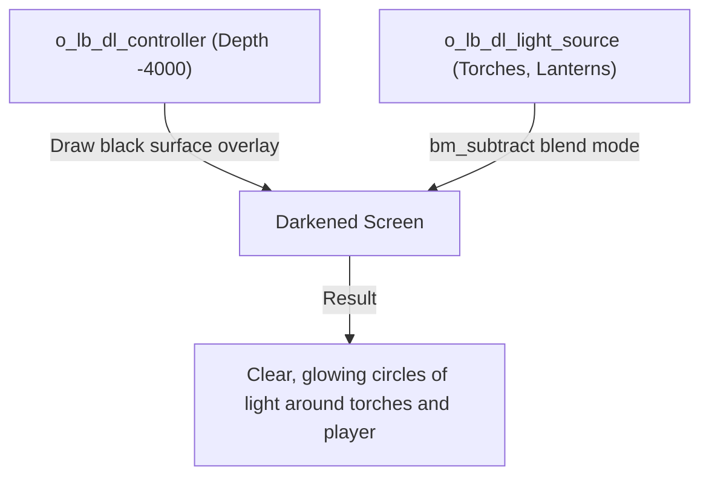

# Lighting and atmosphere

Atmosphere in DELTARUNE is more than tiles and sprites — it is the golden spotlight illuminating a prophecy mural, the gloomy darkness of an ancient cavern pierced by lanterns, the rippling water reflections under the party's boots, and the rhythm of footsteps echoing in an empty hallway.

tlDR Engine provides dedicated subsystems for each of these elements:
1. **Dark Lighting System** (`o_lb_dl_controller`, `o_lb_dl_light_source`) — surface-based dynamic shadows and circular light cones.
2. **Atmospheric Spotlights** (`scripts/lighting/lighting.gml`, `o_eff_lighting_controller`) — colored room fades and altar highlights.
3. **Floor Reflections** (`o_reflection_manager`) — mirrored silhouettes on shiny water or polished marble.
4. **Soundscapes and Borders** (`o_dev_ambiance`, `o_dev_music`, `o_dev_border`).

This chapter explains each system, followed by a hands-on tutorial to build a dark cavern with glowing lanterns, reflective water puddles, and an altar spotlight.

---

## How dynamic lighting and atmosphere work



1. **Surface-based Dark Lighting:** The `o_lb_dl_controller` object sits at depth `-4000` (above all sprites). Every frame, it draws a semi-transparent black surface, then uses `gpu_set_blendmode(bm_subtract)` to cut clean circular holes wherever an `o_lb_dl_light_source` is placed.
2. **Global Altar Lighting:** Calling `lighting_on(color, fade_color)` dims non-essential props via `lighting_darken_self()` and casts a dramatic color tint over the scene.
3. **Water Reflections:** `o_reflection_manager` scans for actors with `can_reflect = true` and renders vertically flipped, translucent silhouettes on reflective floor tiles.

---

## Tutorial: Your first dark room with lanterns and reflections in 5 steps

Let's build a gloomy underground cavern containing:
1. Complete ambient darkness (`o_lb_dl_controller`).
2. Two warm glowing lanterns (`o_lb_dl_light_source`).
3. A reflective water pool (`o_reflection_manager`).
4. Footstep sound effects and ambient soundtrack (`o_dev_ambiance`, `o_dev_music`).
5. An ancient altar trigger that bathes the room in golden light (`lighting_on`).

---

### Step 0 — Prepare the cavern room

1. Create a new room in GameMaker (e.g. `room_cavern`).
2. Add your standard two objects on the `Instances` layer (depth `300`):
   - **`o_dev_world`** (`world = WORLD_TYPE.DARK`)
   - **`o_dev_playermarker`**
3. Draw floor tiles and solid wall collision blocks (`o_block`).

---

### Step 1 — Submerge the room in darkness (`o_lb_dl_controller`)

1. Select the **`Instances`** layer (depth `300`).
2. Drag an instance of **`o_lb_dl_controller`** anywhere in the room.

When you boot the game, the controller automatically covers the screen in a dark shadow overlay at depth `-4000`.

---

### Step 2 — Place glowing light sources (`o_lb_dl_light_source`)

Now let's place light circles so the player can see:

1. Drag an instance of **`o_lb_dl_light_source`** near the player spawn marker (`o_dev_playermarker`).
2. Drag another instance of **`o_lb_dl_light_source`** over a torch or lantern prop on the wall.
3. In the Room Editor, select the light source instances and adjust their properties:
   - **Scale:** Stretch `scaleX` and `scaleY` to `2.0` or `3.0` to expand the light radius.
   - **Color Blend:** In the Inspector, set **Color** to a warm amber/yellow tint (`#FFAA44`) or cool cyan (`#44AAFF`).

When running, the controller uses `bm_subtract` to punch bright, colored light cones through the darkness overlay.

---

### Step 3 — Add water reflections (`o_reflection_manager`)

1. Place water/reflective tiles on your floor (e.g. in the center of the cavern).
2. Select the **`Instances`** layer.
3. Drag an instance of **`o_reflection_manager`** directly over the water area.

That is it! Whenever Kris, Susie, or any `o_actor` walks across the puddle, their inverted reflection renders under their boots automatically.

---

### Step 4 — Configure footsteps and music (`o_dev_ambiance`, `o_dev_music`)

1. Drag **`o_dev_ambiance`** onto the `Instances` layer:
   - Set **`footsteps = true`** in its Variable Definitions to enable echoing footstep audio.
2. Drag **`o_dev_music`** onto the `Instances` layer:
   - Set **`mus = mus_ex_church`** (or your cavern soundtrack asset).
3. Drag **`o_dev_border`** onto the layer:
   - Set **`_border_name = "border_simple"`** for widescreen border artwork.

---

### Step 5 — Build an altar spotlight trigger (`lighting_on`)

Let's place a dramatic altar at the end of the cavern:

1. Place a prop or sign at the altar (e.g. `o_ow_prophecy` or `o_ow_sign`).
2. Place an **`o_trigger`** in front of the altar.
3. In the trigger's **Instance Creation Code**, write:

```gml
trigger_code = function() {
    // Wash the room in golden light with dark navy shadows
    lighting_on(c_yellow, c_navy);
    
    // Play a brief dialogue
    cutscene_create();
    cutscene_dialogue("* A warm, ancient warmth radiates from the altar.");
    cutscene_play();
};

trigger_exit_code = function() {
    // Restore normal lighting when stepping away
    lighting_off();
};
```

---

## Testing checklist

Run your game (`F5`) and test the atmosphere:

- [ ] The room starts in gloomy darkness.
- [ ] Circular light cones illuminate the player and wall lanterns.
- [ ] Walking across the water puddle displays crisp, inverted character reflections.
- [ ] Footsteps produce rhythmic tapping sound effects.
- [ ] Stepping onto the altar trigger smoothly transitions the room into a golden spotlight.
- [ ] Stepping away from the altar restores standard lighting.

---

## Prop reactivity (`lighting_darken_self`)

To ensure custom background props darken appropriately when an altar spotlight activates, call `lighting_darken_self()` in their **Draw Event**:

```gml
// Draw Event of your custom prop
draw_self();
lighting_darken_self(); // Dims prop when lighting_on() is active
```

---

## Common problems

| Symptom | Cause |
|---|---|
| Darkness surface is completely black and covers lights | Missing `o_lb_dl_light_source` instances, or light sprites have 0 alpha |
| Reflections do not appear on water | `o_reflection_manager` is missing from the room, or distance between actor and manager exceeds 20 px |
| Footsteps do not play when walking | `o_dev_ambiance` missing or `footsteps` variable definition is set to `false` |
| Screen borders are stretched or cut off | Selected border asset name does not match any entry registered in `scripts/borders/borders.gml` |
