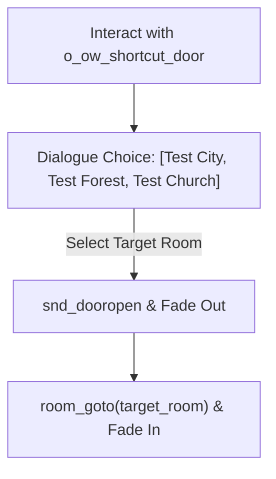

# Shortcut doors and mechanisms

Overworld exploration in DELTARUNE features physical, tactile environmental mechanisms: fast-travel shortcut doors, steep dust slopes that slide the whole party downhill, timed traffic switches, and endless looping rooms.

This chapter explains how each mechanism works, followed by a step-by-step tutorial to build a functioning fast-travel door, a cliff dust slide, and an interactive switch puzzle.

---

## How overworld mechanisms work



1. **Shortcut Doors:** An `o_ow_shortcut_door` displays animated flaming borders (`spr_ow_shortcut_door_fire`). When investigated, it queries its room list, opens a formatted dialogue choice, plays door sound effects, and transitions cleanly between rooms.
2. **Dust Sliders:** Stepping onto `o_trigger_slide` pulls the leader downward at `global.slide_speed`, forces followers into their sliding poses (`s_slide`), and continuously spawns dust particles (`spr_eff_slidedust`).
3. **Interactive Switches:** Triggers and NPCs toggle variables at runtime (e.g. flipping `collide = false` on an `o_block` to open a locked gate).

---

## Tutorial: Your first shortcut door & dust slide in 5 steps

Let's build a sanctuary hub containing two core DELTARUNE mechanisms:
1. A flaming fast-travel shortcut door that links to two destination rooms.
2. A steep hill slope where walking over the ledge sends Kris and Susie sliding downward with dust clouds.

---

### Step 0 — Prepare the room

1. Open your room in the Room Editor.
2. Ensure you have your standard layers (`collisions` at depth `0`, `decor` at depth `200`, `Instances` at depth `300`).

---

### Step 1 — Place the shortcut door (`o_ow_shortcut_door`)

1. Select the **`Instances`** layer (or `decor` at depth `200`).
2. Drag an instance of **`o_ow_shortcut_door`** against a north wall.
3. Open its **Variable Definitions** in the Inspector:

| Variable | Value | Explanation |
|---|---|---|
| **`current_room_name`** | `"Sanctuary"` | The label for this room (greyed out if selected). |
| **`room_1`** | `room_test_main` | Destination Room 1 asset. |
| **`room_1_name`** | `"Test Zone Entrance"` | Label displayed in the choice menu for Room 1. |
| **`room_2`** | `room_ex_city` | Destination Room 2 asset. |
| **`room_2_name`** | `"Cyber City"` | Label displayed in the choice menu for Room 2. |

When the player investigates the door, the engine automatically compiles the choices into `{choice("`Test Zone Entrance`", "`Cyber City`", "`Sanctuary`")}`, fades the screen with `fader_fade()`, plays `snd_dooropen` and `snd_doorclose`, and warps cleanly to the destination.

---

### Step 2 — Place a landing marker in destination rooms

For the warp to position Kris properly:
1. Open each target room (e.g. `room_test_main`).
2. Ensure there is an **`o_dev_marker_land`** with `m_id = 0` on the `Instances` layer.

---

### Step 3 — Build a slope dust slide (`o_trigger_slide`)

1. Back in your hub room, place a cliff ledge with floor tiles at the top and floor tiles at the bottom.
2. Select the **`Instances`** layer.
3. Drag an instance of **`o_trigger_slide`** onto the slope.
4. Stretch its bounding box so it spans the entire width of the ledge and the full height down to the lower floor.

`o_trigger_slide` requires **zero code**:
- As soon as Kris steps onto it, the leader is locked into downward movement.
- Susie, Ralsei, and other party members automatically switch to their sliding sprites (`spr_susie_slide`).
- Slidedust particles (`spr_eff_slidedust`) emit under everyone's feet.
- When reaching the bottom, followers smoothly interpolate back into following line (`party_member_interpolate()`).

---

### Step 4 — Add an interactive switch that opens a gate

Let's place a switch that unlocks a passage by removing collision:

1. Select the **`collisions`** layer and place an `o_block` across an archway. Name this instance `inst_iron_gate`.
2. Select the **`Instances`** layer and place an `o_ow_npc` (or sign/switch). Set its sprite to `spr_ex_ow_church_switch`.
3. In its **Instance Creation Code**, write:

```gml
interaction_code = function() {
    // Flip switch sprite frame
    image_index = 1;
    audio_play(snd_switch);
    
    // Open the iron gate by turning off collision
    with (inst_iron_gate) {
        collide = false;
    }
    
    // Play a brief dialogue
    cutscene_create();
    cutscene_dialogue("* The iron gate clicked and unlocked!");
    cutscene_play();
};
```

---

### Step 5 — Test and verify checklist

Run your game (`F5`) and test the mechanisms:

- [ ] Approaching `o_ow_shortcut_door` and pressing confirm opens the destination choice box.
- [ ] Selecting a destination plays door audio, fades out, and spawns the party in the new room.
- [ ] Walking over the cliff ledge activates `o_trigger_slide`.
- [ ] Kris and followers slide together with dust puff particles.
- [ ] Exiting the slide restores normal top-down walking smoothly.
- [ ] Interacting with the switch unlocks the iron gate wall without errors.

---

## Endless looping rooms (`room_ex_infinity_room`)

To create an infinite wrapping room where walking off the right edge wraps smoothly to the left:

1. In the room's **Room Creation Code**, define the coordinate transposition:
   ```gml
   global.__transpose_player = function(dx, dy) {
       o_camera.x += dx;
       o_camera.y += dy;
       
       for (var i = 0; i < party_length(true); i++) {
           var inst = party_get_inst(global.party_names[i]);
           inst.x += dx;
           inst.y += dy;
           party_member_interpolate(global.party_names[i]);
       }
   };
   ```

2. Place an `o_trigger` on the left border (`inst_edge_left`):
   ```gml
   trigger_code = function() {
       triggered = false;
       if (get_leader().x - get_leader().xprevious) < 0 {
           global.__transpose_player(room_width - 80, 0);
       }
   };
   ```

---

## Common problems

| Symptom | Cause |
|---|---|
| Shortcut door does not show destination names | Target room asset is missing or invalid in Variable Definitions |
| Player gets stuck sliding at the bottom of a slope | `o_trigger_slide` was placed overlapping an `o_block` collision wall |
| Party members desync after sliding | `party_member_interpolate()` was interrupted or followers lacked `s_slide` sprite |
| Infinite room wrap causes visual jitter | Camera was not transposed by the exact same `(dx, dy)` as party members |
| Switch opens gate, but player cannot walk through | `inst_iron_gate` was not found or `collide = false` was called on the wrong instance |
