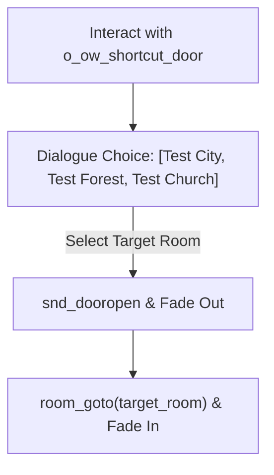

# Shortcut doors and mechanisms

Overworld exploration in DELTARUNE features physical, tactile environmental mechanisms: fast-travel shortcut doors, steep dust slopes that slide the whole party downhill, timed traffic switches, and endless looping rooms.

This chapter covers how to implement these mechanisms in your rooms using the tlDR Engine's built-in objects.

---

## 1. Fast-travel shortcut doors (`o_ow_shortcut_door`)

DELTARUNE's signature shortcut door is an interactive wooden door framed by flickering magical flames (`spr_ow_shortcut_door_fire`). Investigating it opens a multi-choice destination prompt.



### Configuring a shortcut door

1. Place an instance of **`o_ow_shortcut_door`** on your `Instances` layer (depth `200`).
2. Open its **Variable Definitions** in the GameMaker Inspector:

| Variable | Type | Example | Description |
|---|---|---|---|
| **`current_room_name`** | String | `"Test Zone"` | The name of the current area (disabled/greyed out in menu). |
| **`room_1`** | Room Asset | `room_ex_dforest` | Destination Room 1. |
| **`room_1_name`** | String | `"Bake Sale Forest"` | Label displayed for destination 1. |
| **`room_2`** | Room Asset | `room_ex_city` | Destination Room 2. |
| **`room_2_name`** | String | `"Cyber City"` | Label displayed for destination 2. |
| **`room_3`** | Room Asset | `room_ex_church` | Destination Room 3. |
| **`room_3_name`** | String | `"Sanctuary"` | Label displayed for destination 3. |

The door automatically resolves string labels through the localization system `loc()`, opens a formatted choice dialogue (`{choice(...)}`), plays opening/closing door audio (`snd_dooropen`, `snd_doorclose`), and fades smoothly between rooms.

---

## 2. Slope and cliff sliding (`o_trigger_slide`)

In rooms like `room_test_loopback`, walking over a cliff slope automatically locks the party into a high-speed downward slide (`objects/o_trigger_slide/`).

### How `o_trigger_slide` works

When the player enters an `o_trigger_slide` instance:
1. **Leader movement:** The leader is pulled downwards at `global.slide_speed` (default `12` px/frame).
2. **Followers join:** Followers immediately switch to their sliding sprites (`s_slide`, e.g. `spr_susie_slide`), align horizontally, and slide down together.
3. **Puff animation:** Slidedust particles (`spr_eff_slidedust`) spawn periodically under everyone's feet.
4. **Exit & Recovery:** When exiting the bottom of the trigger, followers smoothly interpolate back into line (`party_member_interpolate()`) and normal walking resumes.

### Setting up a slide trigger

1. Place **`o_trigger_slide`** on your `Instances` layer.
2. Stretch its width to match your slope and its height from the cliff ledge down to the landing floor.
3. No code is required — placing the trigger is all it takes.

---

## 3. Interactive switches & timed puzzles

tlDR Engine includes generic and timed switches for environmental puzzles (such as the traffic lights in `room_ex_city` and church switches in `room_ex_church`).

### Timed traffic switches (`o_ex_ow_city_traffic_switch`)

In `room_ex_city`, pressing a walk switch halts oncoming traffic for a countdown timer:

```gml
// Instance Creation Code of the switch
switch_id = 1;
label = "walk";
time = 8; // Halts cars for 8 seconds
```

The switch broadcasts its state to all `o_ex_ow_city_traffic_light` instances sharing `switch_id = 1`, turning them red and pausing car spawners.

### Toggling obstacles and doors at runtime

To make a switch open a passage, modify the `collide` variable of the target `o_block` walls:

```gml
// Instance Creation Code of an interactive switch
interaction_code = function() {
    audio_play(snd_switch);
    image_index = 1; // Flip switch sprite
    
    // Deactivate the barrier wall
    with (inst_gate_block) {
        collide = false;
    }
    
    // Play a rumble effect or dialogue
    cutscene_create();
    cutscene_dialogue("* The iron gate opened somewhere nearby!");
    cutscene_play();
};
```

---

## 4. Seamless infinite looping rooms

`room_ex_infinity_room` demonstrates how to create a room that wraps endlessly in all directions without loading new rooms.

### How wrapping works

1. Place `o_trigger` instances along all four edges of the room (`inst_edge_left`, `inst_edge_right`, `inst_edge_top`, `inst_edge_bottom`).
2. In the room's **Room Creation Code**, define a transposition helper that shifts the camera and all party members simultaneously:

```gml
// Room Creation Code
global.__transpose_player = function(dx, dy) {
    o_camera.x += dx;
    o_camera.y += dy;
    
    for (var i = 0; i < party_length(true); i++) {
        var inst = party_get_inst(global.party_names[i]);
        inst.x += dx;
        inst.y += dy;
        party_member_interpolate(global.party_names[i]);
    }
};
```

3. In the left edge trigger's **Instance Creation Code**, shift the player to the right edge:

```gml
// Left Edge Trigger
trigger_code = function() {
    triggered = false;
    // If player is walking left across the border, wrap to right side
    if (get_leader().x - get_leader().xprevious) < 0 {
        global.__transpose_player(room_width - 80, 0);
    }
};
```

Because camera, leader, followers, and interpolation history are shifted by the exact same delta on the same frame, the wrap is **completely imperceptible** to the player.

---

## Common problems

| Symptom | Cause |
|---|---|
| Shortcut door does not show destination names | Target room asset is missing or invalid in Variable Definitions |
| Player gets stuck sliding at the bottom of a slope | `o_trigger_slide` was placed overlapping an `o_block` collision wall |
| Party members desync after sliding | `party_member_interpolate()` was interrupted or followers lacked `s_slide` sprite |
| Infinite room wrap causes visual jitter | Camera was not transposed by the exact same `(dx, dy)` as party members |
