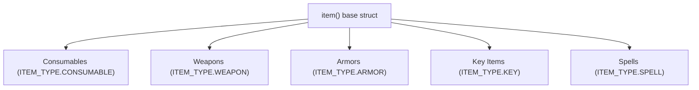

# Items, equipment, and spells

In tlDR Engine, all items — snacks, key items, swords, defensive ribbons, and magic spells — inherit from a single flexible structure: the **`item()` constructor** (`scripts/item/item.gml`). Items can be used from the overworld pause menu, selected during turn-based combat, equipped by specific party members, bought/sold in shops, or discovered inside chests.

This chapter covers the item architecture, followed by a step-by-step tutorial to create custom consumables, weapons, spells, and treasure chests.

---

## How items work in the engine

Every item is an instance of a struct inheriting from `item()`:



### The 7 Item Types (`ITEM_TYPE`)

| Type | Inventory Tab | Max Capacity | Behavior |
|---|---|---|---|
| **`ITEM_TYPE.CONSUMABLE`** | ITEMS | 12 slots | Single-use items (healing, buffs, TP items). Deleted after use (`item_delete`). |
| **`ITEM_TYPE.WEAPON`** | WEAPONS | 48 slots | Equippable weapons that increase `attack` and weapon elements. |
| **`ITEM_TYPE.ARMOR`** | ARMOR | 48 slots | Equippable defensive accessories that increase `defense` and `magic`. |
| **`ITEM_TYPE.KEY`** | KEY ITEMS | 48 slots | Plot items that cannot be dropped or sold to vendors. |
| **`ITEM_TYPE.SPELL`** | MAGIC | Bound to Party | Spells that consume TP (`tp_cost`) in battle or out-of-battle. |
| **`ITEM_TYPE.STORAGE`** | STORAGE BOX | 12 slots/page | Items stored in dimensional boxes or Castle Town chests. |
| **`ITEM_TYPE.LIGHT`** | LIGHT ITEMS | 12 slots | Items held while in the Light World. |

---

## Tutorial: Your first item & chest in 5 steps

Let's create:
1. A single-target consumable snack that heals 80 HP and triggers unique party dialogue quotes.
2. A party-wide feast item that heals the entire team.
3. A custom weapon for Kris that boosts attack.
4. An overworld treasure chest (`o_ow_chest`) in your room that awards the item when opened.

---

### Step 0 — Create your items script

1. In the GameMaker **Asset Browser**, right-click `scripts` $
ightarrow$ **Create** $
ightarrow$ **Script**.
2. Name it **`my_game_items`**.
3. Clear any default template code.

---

### Step 1 — Write a consumable healing item

Add your consumable item constructor to `my_game_items.gml`:

```gml
function item_star_candy() : item() constructor {
    // 1. Display name: [Short Name, Long Name]
    name = ["StarCandy", "Star Candy"];
    
    // 2. Descriptions: [Overworld menu, Battle submenu, Action summary, Shop preview]
    desc = [
        "A sugary, glowing star candy.
Restores 80 HP.",
        "Heals 80HP",
        "Heals 80HP",
        "A sweet star that restores 80 HP."
    ];
    
    type = ITEM_TYPE.CONSUMABLE;
    use_type = ITEM_USE.INDIVIDUAL; // Targets one party member
    
    // 3. What happens when used in Overworld or Battle
    use = function(item_index, target_index, caller = -1) {
        // target_index points to the selected character in global.party_names
        var target_name = global.party_names[target_index];
        party_heal(target_name, 80, caller);
        
        // Remove item from inventory upon consumption
        item_delete(item_index, ITEM_TYPE.CONSUMABLE);
    };
    
    // 4. Character reaction quotes when fed this item
    reactions = {
        kris: "(It tastes like lemon and stardust.)",
        susie: "Hell yeah, crunchy!",
        ralsei: "It's so sparkly and sweet!",
        noelle: "(Reminds me of holiday lights...)"
    };
    
    // 5. Economy values
    buy_price = 120;
    sell_price = 40;
}
```

---

### Step 2 — Write a team-wide consumable

If an item should heal or affect the entire party simultaneously (like the Top Cake or Spin Cake), set `use_type = ITEM_USE.EVERYONE` and call `party_heal_all()`:

```gml
function item_star_cake() : item() constructor {
    name = ["StarCake", "Star Cake"];
    desc = [
        "A fluffy cake decorated with star icing.
Restores 100 HP to everyone.",
        "Heals team 100HP"
    ];
    
    type = ITEM_TYPE.CONSUMABLE;
    use_type = ITEM_USE.EVERYONE; // Targets whole team
    
    use = function(item_index, target_index, caller = -1) {
        party_heal_all(100, caller);
        item_delete(item_index, ITEM_TYPE.CONSUMABLE);
    };
    
    reactions = {
        susie: "Gimme the biggest slice!!",
        ralsei: "Delicious! Thank you, Kris!",
        noelle: "Mmm! It's so warm and fluffy!"
    };
    
    buy_price = 300;
    sell_price = 100;
}
```

---

### Step 3 — Write a custom weapon (`item_weapon`)

Weapons inherit from `item_weapon()` (`scripts/items_weapons/items_weapons.gml`). They provide stat boosts, weapon icons, and character whitelists:

```gml
function item_w_starlight_sword() : item_weapon() constructor {
    name = ["Starlight Sword"];
    desc = [
        "A shimmering blade forged from fallen star fragments.
Attack +5, Magic +2.",
        "--"
    ];
    
    // Who is allowed to equip this weapon
    weapon_whitelist = ["kris"];
    
    // Stat modifiers added to the character's base stats
    stats = {
        attack: 5,
        magic: 2,
        defense: 0
    };
    
    // Menu icon and UI status effect text
    icon = spr_ui_menu_icon_sword;
    effect = {
        text: "Star Power",
        sprite: spr_ui_menu_icon_up
    };
    
    // Character comments when inspecting this weapon in the EQUIP menu
    reactions = {
        kris: "Feels perfectly balanced.",
        susie: "Pfft, too shiny for me.",
        ralsei: "What a radiant blade!",
        noelle: "(It glows so brightly...)"
    };
    
    // Light World counterpart (e.g. transforms into a shiny gel pen)
    lw_counterpart = item_w_lw_pencil;
    
    buy_price = 450;
    sell_price = 150;
}
```

---

### Step 4 — Place a treasure chest in your room (`o_ow_chest`)

1. Open your room in the GameMaker Room Editor.
2. Select the **`Instances`** layer (depth `300`).
3. Drag an instance of **`o_ow_chest`** onto the floor.
4. In the Inspector, open its **Variable Definitions**:
   - Set **`item_inside`** to your struct instantiation:
     ```gml
     new item_star_candy()
     ```
   - (Optional) Set **`money_inside`** if the chest should grant Dark Dollars instead of an item.

`o_ow_chest` handles everything automatically (`objects/o_ow_chest/`):
- Plays opening creak audio (`snd_chestopen`).
- Adds the item to inventory with `item_add()`.
- Displays dialogue: `* You found the Star Candy! * (Added to your ITEMS.)`.
- Saves state in persistent memory (`memory_set("chests", id, true)`) so the chest stays open forever.

---

### Step 5 — Test and verify checklist

Run your game (`F5`) and test:

- [ ] Approaching `o_ow_chest` and pressing confirm opens the chest and displays the pickup text.
- [ ] Opening the pause menu (`[C]` / `[CTRL]`) shows `StarCandy` in your **ITEMS** tab.
- [ ] Using the item heals the selected character's HP and displays their custom reaction quote.
- [ ] Opening the chest a second time shows it remains empty and already opened.
- [ ] In the **EQUIP** menu, Kris can equip `Starlight Sword` and their attack stat increases by +5.

---

## Giving and managing items via script

You can grant or remove items directly in cutscenes, dialogue scripts, or battle rewards:

```gml
// Add an item to the player's inventory
item_add(new item_star_candy());

// Check if player has inventory space for a consumable
if array_length(global.item) < item_get_maxcount(ITEM_TYPE.CONSUMABLE) {
    item_add(new item_star_candy());
} else {
    // Inventory full — send to storage or show dialogue
    item_add(new item_star_candy(), ITEM_TYPE.STORAGE);
}

// Check if party possesses a specific key item
if item_contains(item_key_cellphone) {
    // Trigger special dialogue
}
```

---

## Magic spells (`ITEM_TYPE.SPELL`)

Magic spells (like Susie's Rude Buster or Ralsei's Heal Prayer) are items with `type = ITEM_TYPE.SPELL` and a `tp_cost` (`scripts/items_spells/items_spells.gml`):

```gml
function item_s_star_heal() : item() constructor {
    name = ["StarHeal", "Star Heal"];
    desc = ["Heal an ally with starlight magic.", "Heal Ally"];
    type = ITEM_TYPE.SPELL;
    tp_cost = 32; // Requires 32% TP
    
    use = function(item_index, target_index, caller = -1) {
        var heal_amt = 60 + party_getdata(global.party_names[caller], "magic") * 5;
        party_heal(global.party_names[target_index], heal_amt, caller);
    };
}
```

---

## Common problems

| Symptom | Cause |
|---|---|
| Chest opens but no item is received | `item_inside` was written as a string instead of an expression (`new item_star_candy()`) |
| Consumable is used but never disappears from inventory | Missing `item_delete(item_index)` inside the item's `use` function |
| Character cannot equip a weapon | Character name is missing from `weapon_whitelist` array |
| Weapon stats do not apply to attack/defense | Misspelled stats struct fields (e.g. `att` instead of `attack`) |
| Chest resets to closed every time you enter the room | Chest ID memory was overwritten or not saved properly |
