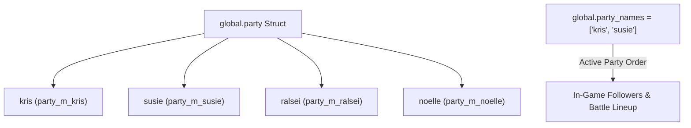

# Party management and the Light World

DELTARUNE's storytelling is built on the contrast between Hometown (the grounded, nostalgic **Light World**) and the fantastical realms (the **Dark World**), alongside dynamic party dynamics between Kris, Susie, Ralsei, and Noelle.

tlDR Engine implements a unified party management architecture (`scripts/party_init/`, `scripts/party_scripts/`) and full dual-world switching (`o_dev_world`, `world_switch()`).

This chapter covers how the party data structures work, how to add/remove companions, how to handle the Light World, and how to manage the enemy Recruits system.

---

## How the party system works

All party member definitions reside in `scripts/party_init/party_init.gml`. When the game starts, the engine initializes `global.party` containing structs for each character (`party_m_kris`, `party_m_susie`, `party_m_ralsei`, `party_m_noelle`).



### Active Party Array (`global.party_names`)

The `global.party_names` array controls who is currently following Kris in the overworld and who participates in combat:

```gml
// Check who is in the active party
if party_contains("susie") {
    // Susie is present!
}

// Get the number of active party members
var count = party_length(true);
```

---

## 1. Adding and removing party members

You can modify party composition on the fly in cutscenes, room triggers, or plot milestones using built-in party helpers (`scripts/party_scripts/party_scripts.gml`):

### Adding a member (`party_add`)

```gml
// Adds Susie to the active follower lineup
party_add("susie");

// Smoothly align the follower trail behind the leader
party_member_interpolate("susie");
```

### Removing a member (`party_remove`)

```gml
// Removes Noelle from the party
party_remove("noelle");
```

### Checking and modifying party stats

```gml
// Read a character's current HP or Attack
var kris_hp = party_getdata("kris", "hp");
var susie_atk = party_getdata("susie", "attack");

// Heal or damage a character
party_heal("susie", 50);
party_damage("kris", 20);

// Heal the entire team
party_heal_all(100);

// Modify a stat directly
party_setdata("kris", "max_hp", 120);
```

---

## 2. The Light World vs. Dark World

When you switch between worlds, the engine transforms gameplay rules and visual aesthetics:

| Feature | Dark World (`WORLD_TYPE.DARK`) | Light World (`WORLD_TYPE.LIGHT`) |
|---|---|---|
| **Kris Appearance** | Blue skin, silver armor, cape | Striped green sweater, brown skin |
| **Party** | Full team (Kris, Susie, Ralsei, Noelle) | Kris alone (Susie follows as separate NPC) |
| **Pause Menu** | Full `o_ui_menu` (ITEMS, EQUIP, POWER, CONFIG) | Minimal `o_ui_menu_lw` (ITEM, STAT, CELL, CONFIG) |
| **Stats Display** | HP, Attack, Defense, Magic, TP Bar | HP, LV, EXP, Next, Guts |
| **Equipment** | Magic Swords, Axes, Scarves, Ribbons | School Pencils, Wristwatches, Bandages |

### Building a Light World room

To make any room a Light World room:

1. Place **`o_dev_world`** on the `Instances` layer (depth `300`).
2. Open its **Variable Definitions** in the Inspector.
3. Set **`world`** to **`WORLD_TYPE.LIGHT`**.

When the room loads, `o_dev_world` calls `world_switch(WORLD_TYPE.LIGHT)`:
- Kris switches to Light World sprites (`spr_kris_lw_*`).
- Followers automatically detach so Kris walks alone.
- Equipment transforms into Light World counterparts.
- The pause menu switches to `o_ui_menu_lw`.

---

## 3. Dual-World item counterparts

In DELTARUNE, items change form between worlds (a spooky sword in the Dark World becomes a Halloween pencil in the Light World; a pile of dark candy becomes a pile of chalk).

In your item definitions, use `lw_counterpart` and `dw_counterpart`:

```gml
// Dark World Item definition
function item_w_spookysword() : item_weapon() constructor {
    name = ["Spookysword"];
    stats = { attack: 2 };
    
    // Automatically transforms into this item when entering the Light World
    lw_counterpart = item_w_lw_halloween_pencil;
}

// Light World Item definition
function item_w_lw_halloween_pencil() : item_weapon() constructor {
    name = ["Halloween Pencil"];
    stats = { attack: 1 };
    
    // Automatically transforms back when entering the Dark World
    dw_counterpart = item_w_spookysword;
}
```

---

## 4. The Recruits System (`recruits.gml`)

In DELTARUNE Chapter 2, sparing enemies repeatedly recruits them to Castle Town. tlDR Engine includes full recruit progress tracking (`scripts/recruits/recruits.gml`).

### How recruits work

Every enemy definition can specify its recruit requirement in `scripts/enc_enemies_recruits/`:

```gml
// In an enemy struct definition:
recruit_need = 3; // Sparing this enemy 3 times recruits them permanently
```

When spared in battle, the engine calls `recruit_advance(enemy)`:
- Spawns the recruitment progress counter (e.g. `1/3`, `2/3`, `RECRUITED!`).
- Once fully recruited, the recruit appears in Castle Town rooms or the Recruits Menu (`o_ui_recruits`).

### Checking recruit status in scripts

```gml
// Check if an enemy has been successfully recruited
if recruit_isrecruited(new enc_e_virovirokun()) {
    // Spawn the NPC in your town room!
}
```

---

## Tutorial: Your first party join cutscene in 5 steps

Let's script a scene where Kris meets Susie in a room, speaks with her, and Susie joins the active party.

---

### Step 0 — Place Susie as an overworld NPC

1. In your room on the `Instances` layer, place an `o_ow_npc`.
2. Set its sprite to `spr_ow_npc_susie_idle`.
3. Give this instance the name `inst_susie_npc`.

---

### Step 1 — Write the recruitment interaction code

In `inst_susie_npc`'s **Instance Creation Code**:

```gml
// If Susie is already in the party, remove this standalone NPC
if party_contains("susie") {
    instance_destroy();
    exit;
}

interaction_code = function() {
    cutscene_create();
    cutscene_player_canmove(false);
    
    // 1. Dialogue
    cutscene_dialogue([
        "{char(susie, 0)}* Hey Kris.",
        "{char(susie, 4)}* You ready to explore? Let's go!"
    ]);
    
    // 2. Susie joins the team
    cutscene_func(function(npc_inst) {
        // Add Susie to global party array
        party_add("susie");
        party_member_interpolate("susie");
        
        // Destroy the static NPC instance
        instance_destroy(npc_inst);
        audio_play(snd_item);
    }, [id]);
    
    cutscene_player_canmove(true);
    cutscene_play();
};
```

---

### Step 2 — Test and verify checklist

Run your game (`F5`):

- [ ] Approaching the Susie NPC and pressing confirm triggers dialogue.
- [ ] After dialogue finishes, the standalone NPC disappears and Susie lines up cleanly behind Kris.
- [ ] Opening the pause menu (`[C]`) shows Susie's HP, equipment, and spells.
- [ ] Entering a battle encounter brings both Kris and Susie into combat.

---

## Common problems

| Symptom | Cause |
|---|---|
| Light World room still shows Dark World menu and sprites | `o_dev_world` was missing or its `world` variable definition was not set to `WORLD_TYPE.LIGHT` |
| Follower teleports across screen when added | Forgot to call `party_member_interpolate(name)` right after `party_add(name)` |
| Dual-world item disappears when changing rooms | `lw_counterpart` or `dw_counterpart` was written as a string instead of a script reference |
| Party member stats show 0 in battle | Character was not registered in `scripts/party_init/party_init.gml` |
