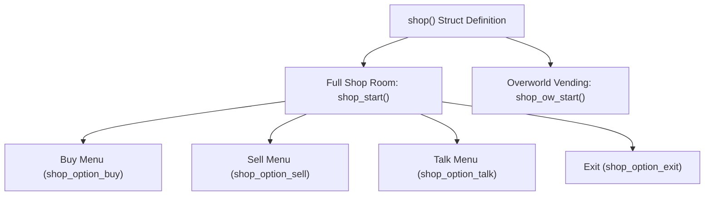

# Shops and vendors

Shops in DELTARUNE are memorable character moments: cozy theme music, animated shopkeeper portraits, interactive item catalogs, and rich conversational dialogue.

tlDR Engine implements two distinct shopping systems:
1. **Full Dedicated Shop Rooms** (`shop_start()`) — transitions to the dedicated shop screen (`o_shop`) with an animated shopkeeper, buy/sell menus, conversation topics, and contextual dialogue reactions.
2. **Overworld Quick Shops / Vending Machines** (`shop_ow_start()`) — opens a lightweight purchasing overlay directly in the overworld without leaving the current room.

This chapter covers the shop architecture, followed by a step-by-step tutorial to create a custom vendor and vending machine.

---

## How the shop system works

A shop is defined as a struct inheriting from **`shop()`** (`scripts/shops/shops.gml`):



### The 4 Standard Shop Options

| Option Constructor | Purpose |
|---|---|
| **`new shop_option_buy(items, callback)`** | Catalog of items for sale, with dynamic dialogue reactions when purchasing, lacking funds, or when inventory is full. |
| **`new shop_option_sell([callback])`** | Allows the player to sell consumables, weapons, or armor for Dark Dollars ($). |
| **`new shop_option_talk(topics, [callback])`** | A submenu of lore topics and conversations that develop the shopkeeper's personality. |
| **`new shop_option_exit(leave_text)`** | Closes the shop and returns the player to the overworld. |

---

## Tutorial: Your first shop in 5 steps

Let's build a custom vendor — the **Starlight Cafe** — complete with items for sale, stock limits, conversational topics, and an overworld storefront.

---

### Step 0 — Create your shop script

1. In the GameMaker **Asset Browser**, right-click `scripts` $
ightarrow$ **Create** $
ightarrow$ **Script**.
2. Name it **`my_game_shops`**.

---

### Step 1 — Define the shop struct (`shop()`)

In `my_game_shops.gml`, define your shop struct:

```gml
function shop_starlight_cafe() : shop() constructor {
    // 1. Soundtrack and presentation
    bgm = mus_ex_hip_shop;
    bgm_gain = 0.95;
    
    // 2. Greeting flavor text when entering the shop
    flavor = "* Welcome to the Starlight Cafe! How can I help you today?";
    
    // 3. Items available for purchase
    var item1 = new item_star_candy();
    var item2 = new item_star_cake();
    var item3 = new item_w_starlight_sword();
    
    // Set stock limits (infinity by default)
    item3.shop_in_stock = 1; // Only 1 sword available in stock!
    
    var shop_catalog = [item1, item2, item3];
```

---

### Step 2 — Configure contextual buy and sell dialogue

Shopkeepers react dynamically to the player's actions via `SHOP_TALK_CONTEXT` enum values:

```gml
    options = [
        // --- BUY MENU ---
        new shop_option_buy(shop_catalog, function(context) {
            switch context {
                case SHOP_TALK_CONTEXT.IDLE:
                    return "* What catches your eye?";
                case SHOP_TALK_CONTEXT.BOUGHT:
                    return "* Thank you! A wonderful choice.";
                case SHOP_TALK_CONTEXT.BOUGHT_STORAGE:
                    return "* Your pockets were full, so I sent it to your STORAGE.";
                case SHOP_TALK_CONTEXT.NOT_ENOUGH:
                    return "* Oh dear... you don't have enough Dark Dollars for that.";
                case SHOP_TALK_CONTEXT.NO_SPACE:
                    return "* You can't carry any more of that item!";
                case SHOP_TALK_CONTEXT.CANCELED:
                    return "* Changed your mind?";
            }
        }),
        
        // --- SELL MENU ---
        new shop_option_sell(function(context) {
            switch context {
                case SHOP_TALK_CONTEXT.IDLE:
                    return "* Got something rare to trade in?";
                case SHOP_TALK_CONTEXT.SOLD:
                    return "* Pleasure doing business with you!";
                case SHOP_TALK_CONTEXT.NO_ITEMS:
                    return "* You don't have anything to sell.";
                case SHOP_TALK_CONTEXT.REFUSE:
                    return "* I cannot buy key items from you.";
                case SHOP_TALK_CONTEXT.CANCELED:
                    return "* Keeping your gear? Smart.";
            }
        }),
```

---

### Step 3 — Add conversational talk topics

The `shop_option_talk` constructor takes an array of `__shop_talk_option(title, dialogue_text)` structs:

```gml
        // --- TALK MENU ---
        new shop_option_talk([
            new __shop_talk_option("About this cafe", [
                "* This cafe was built from fallen stardust long ago.",
                "* Travelers from all over the Dark World rest here."
            ]),
            new __shop_talk_option("The Dark Fountain", [
                "* The towering fountain to the east?",
                "* It gives our world form... but beware the shadows near it."
            ]),
            new __shop_talk_option("Your friends", [
                "* That purple dragon girl looks fierce!",
                "* Make sure she gets plenty of snacks."
            ])
        ], function(context) {
            return "* What would you like to chat about?";
        }),
        
        // --- EXIT ---
        new shop_option_exit("* Safe travels, Lightners! Come back soon.")
    ];
}
```

---

### Step 4 — Build the overworld storefront (`shop_start`)

Now let's place a shopkeeper NPC or stall in your overworld room that opens the shop:

1. In your room on the `Instances` layer, place an `o_ow_npc` (or custom stand like `o_ex_ow_swatch_stand`).
2. Set its sprite (e.g. `spr_ex_ow_npc_swatch`).
3. In its **Instance Creation Code**, write:

```gml
// Instance Creation Code of the shop NPC
return_marker = 1; // ID of the o_dev_marker_land where Kris spawns upon exiting

interaction_code = function() {
    // Launch full shop room
    shop_start(new shop_starlight_cafe(), room, return_marker);
};
```

Make sure there is an **`o_dev_marker_land`** with `m_id = 1` in your room so Kris lands in front of the counter when leaving the shop!

---

### Overworld Vending Machines (`shop_ow_start`)

For quick purchases (like soda machines or bake sale stands) where the player shouldn't leave the current overworld room:

```gml
// Instance Creation Code of a vending machine (o_ex_ow_vending_machine)
interaction_code = function() {
    var quick_shop = new shop_starlight_cafe();
    quick_shop.bgm = undefined;        // Don't interrupt room music
    quick_shop.shopkeeper = undefined; // No shopkeeper portrait
    
    // Open lightweight overworld shopping overlay
    shop_ow_start(quick_shop);
};
```

---

### Step 5 — Test and verify checklist

Run your game (`F5`) and test your new shop:

- [ ] Interacting with the shopkeeper transitions cleanly to the shop screen with `mus_ex_hip_shop`.
- [ ] The **BUY** menu displays the 3 items with their respective prices.
- [ ] Buying the `Starlight Sword` reduces stock to `0` and shows `SOLD OUT`.
- [ ] Attempting to buy without enough money displays the custom `NOT_ENOUGH` message.
- [ ] The **TALK** menu displays your 3 topics and renders the formatted dialogue.
- [ ] Selecting **EXIT** returns the party to `o_dev_marker_land` in the overworld.

---

## Animated shopkeeper portraits (`o_shop_shopkeep`)

To give your vendor an animated portrait in the shop screen:

1. Create an object inheriting from **`o_shop_shopkeep`** (like `o_ex_shop_shopkeep_swatch`).
2. Assign idle and talking sprites in its Create Event:
   ```gml
   event_inherited();
   s_idle = spr_shopkeep_swatch_idle;
   s_talk = spr_shopkeep_swatch_talk;
   ```
3. In your shop struct, assign the shopkeeper object:
   ```gml
   shopkeeper = o_my_custom_shopkeep;
   shopkeeper_x = 160;
   shopkeeper_y = 120;
   ```

When dialogue text scrolls, the shopkeeper automatically switches to `s_talk` and animates their mouth until the text pauses.

---

## Common problems

| Symptom | Cause |
|---|---|
| Exiting the shop spawns Kris at `(0, 0)` | Missing `o_dev_marker_land` with matching `m_id` in the return room |
| Shop items show cost 0 | `buy_price` was omitted or set to 0 in the item struct definition |
| Shop crashes on talk option | Topic dialogue array was not formatted as string array or string |
| Vending machine crashes | Used `shop_start()` instead of `shop_ow_start()` without setting return room |
